# Java Full Stack Interview Prep

A structured reference guide for full-stack Java interviews covering core Java, Spring Boot, and Apache Kafka — with definitions, internals, trade-offs, code examples, and system-design patterns.

---

## Table of Contents

1. [How to Use This Guide](#how-to-use-this-guide)
2. [Java](#java)
   - [OOP & Language Fundamentals](#oop--language-fundamentals)
   - [Collections Framework](#collections-framework)
   - [Exception Handling](#exception-handling)
   - [Java 8+ Features](#java-8-features)
   - [Concurrency & Multithreading](#concurrency--multithreading)
   - [JVM, Memory & Garbage Collection](#jvm-memory--garbage-collection)
   - [Design Principles & Patterns](#design-principles--patterns)
3. [Spring Boot](#spring-boot)
   - [Core Concepts & IoC/DI](#core-concepts--iocdi)
   - [Bean Lifecycle & Scopes](#bean-lifecycle--scopes)
   - [Auto-Configuration](#auto-configuration)
   - [Web Layer & REST APIs](#web-layer--rest-apis)
   - [Data Access & JPA](#data-access--jpa)
   - [Transactions](#transactions)
   - [Spring Security](#spring-security)
   - [Testing](#testing)
   - [Production & Operations](#production--operations)
   - [Microservices & Spring Cloud](#microservices--spring-cloud)
4. [Apache Kafka](#apache-kafka)
   - [Fundamentals & Architecture](#fundamentals--architecture)
   - [Topics, Partitions & Offsets](#topics-partitions--offsets)
   - [Producers](#producers)
   - [Consumers & Consumer Groups](#consumers--consumer-groups)
   - [Delivery Semantics](#delivery-semantics)
   - [Replication & Durability](#replication--durability)
   - [Retention & Compaction](#retention--compaction)
   - [Kafka vs Alternatives](#kafka-vs-alternatives)
   - [Spring Kafka Integration](#spring-kafka-integration)
   - [System Design Patterns](#system-design-patterns)
5. [Deep Dive](#deep-dive)
   - [Java Deep Dive](#java-deep-dive)
     - [HashMap Internals](#dd-hashmap-internals)
     - [JVM Memory & Garbage Collection](#dd-jvm-gc)
     - [Concurrency & the Java Memory Model](#dd-concurrency-jmm)
     - [Future, Callable & CompletableFuture](#dd-future-completable)
     - [Virtual Threads (Java 21+)](#dd-virtual-threads)
     - [Class Loading & Bytecode](#dd-class-loading)
   - [Spring Boot Deep Dive](#spring-boot-deep-dive)
     - [AOP Proxies & `@Transactional`](#dd-spring-proxy-transactional)
     - [JPA Persistence Context & Session](#dd-jpa-persistence-context)
     - [Auto-Configuration Conditions](#dd-auto-config-conditions)
   - [Kafka Deep Dive](#kafka-deep-dive)
     - [Log Segments & Storage](#dd-kafka-log-segments)
     - [Consumer Rebalance Protocol](#dd-consumer-rebalance)
     - [Exactly-Once Semantics (EOS)](#dd-kafka-eos)
     - [Transactional Outbox Pattern](#dd-transactional-outbox)
6. [Cross-Topic Integration](#cross-topic-integration)
7. [Mock Interview Cheat Sheet](#mock-interview-cheat-sheet)
8. [3-Day Study Plan](#3-day-study-plan)
9. [Further Reading](#further-reading)

---

## How to Use This Guide

Each topic follows: **plain English first → example → code → interview answer**. If a section reads like a spec dump, skip to the "30-second version" or "say this out loud" box.

| Technique | How |
|-----------|-----|
| **30-second answer** | State definition → one trade-off → one real example |
| **Deep dive** | Jump to [Deep Dive](#deep-dive) — internals, JVM, Future, virtual threads, proxies, Kafka |
| **System design** | Always mention: ordering, idempotency, failure handling, observability |
| **Stories** | Prepare 2 narratives: one debugging incident, one event-driven design |

**Answer framework:** *What it is → Why it exists → When to use / not use → Pitfalls*

---

# Java

---

## OOP & Language Fundamentals

### Q1. What are the four pillars of OOP?

| Pillar | Definition | Example |
|--------|------------|---------|
| **Encapsulation** | Hide internal state; expose controlled access via methods | Private fields + getters/setters |
| **Inheritance** | IS-A relationship; reuse and extend behavior | `class Dog extends Animal` |
| **Polymorphism** | Same interface, different implementations | `Animal a = new Dog(); a.speak()` |
| **Abstraction** | Hide complexity; expose essential behavior | `interface PaymentGateway { void pay(); }` |

**Interview tip:** Mention **composition over inheritance** — favor `has-a` (wrapping) over deep inheritance hierarchies to avoid fragile base class problems.

---

### Q2. `abstract class` vs `interface`?

| Aspect | Abstract Class | Interface |
|--------|----------------|-----------|
| Fields | Can have instance fields | Only `public static final` constants (pre-Java 9) |
| Methods | Abstract + concrete | Abstract (implicit) + default/static (Java 8+) |
| Inheritance | Single inheritance | Multiple interfaces |
| Constructor | Yes | No |
| Use when | Shared state + partial implementation | Define a capability/contract |

```java
// Interface — capability
public interface Notifiable {
    void send(String message);
    default void log(String msg) { System.out.println(msg); }
}

// Abstract class — shared template
public abstract class BaseEntity {
    protected Long id;
    public abstract void validate();
}
```

**Java 8+:** Interfaces can have `default` and `static` methods. **Java 9+:** private methods in interfaces.

**Modern guidance:** Prefer interfaces for behavior contracts; use abstract classes sparingly when subclasses share substantial code and state.

---

### Q3. `==` vs `.equals()` vs `hashCode()`?

This confuses almost everyone at first. Here it is without the textbook fog.

#### The 30-second version

| | What it checks | Plain English |
|---|----------------|---------------|
| `==` | Same object in memory? | "Are these the **exact same box**?" |
| `.equals()` | Same meaning/value? | "Do these **represent the same thing**?" (only if you define what "same" means) |
| `hashCode()` | A number used by `HashMap` / `HashSet` | "Which **drawer** should this go in?" |

```java
Person a = new Person(1L, "Alice");
Person b = new Person(1L, "Alice");
Person c = a;

a == b;        // false — two different objects on the heap
a == c;        // true  — c points to the same object as a
a.equals(b);   // true  — ONLY if you wrote equals() to compare id
```

**Default `equals()`** (from `Object`) behaves like `==` — same memory address. You override it when two objects can be "the same person" even if they're different instances.

---

#### Real example: why this matters

```java
Map<Person, String> seats = new HashMap<>();
Person alice = new Person(1L, "Alice");

seats.put(alice, "Row 5");

Person lookup = new Person(1L, "Alice");  // new object, same id
seats.get(lookup);  // null ??  — if equals/hashCode are broken
```

You put a value in with one `Person` object and tried to get it with another. They're not `==`, but they **should** be equal if they share the same `id`. `HashMap` uses **both** `equals` and `hashCode` to find entries. Break either one → silent bugs.

---

#### What `hashCode()` actually does (intuition)

Think of `HashMap` as a **wall of mailboxes**:

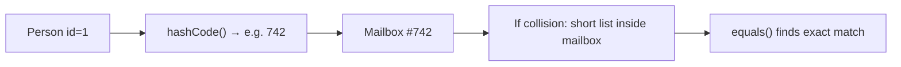

1. `hashCode()` picks **which mailbox** (bucket)
2. `equals()` checks **which letter inside** is the right one (handles collisions)

**Rule you must remember:** If two objects are equal, they **must** land in the same mailbox → **same `hashCode()`**. The reverse is not required (different objects can share a hash — collision is OK).

---

#### The contract — in English first

You override **`equals` and `hashCode` together** (IDE can generate both). Here's what the rules actually mean:

| Formal rule | What it means in practice |
|-------------|---------------------------|
| **Reflexive** — `a.equals(a)` is true | An object equals itself. Obvious. |
| **Symmetric** — if `a.equals(b)` then `b.equals(a)` | Don't write equals that works one way only. |
| **Transitive** — if `a.equals(b)` and `b.equals(c)` then `a.equals(c)` | Don't create weird chains where A=B and B=C but A≠C. |
| **Consistent** | Same inputs → same answer every time. **Don't use mutable fields** in equals if the object lives in a `HashMap` key. |
| **`equals(null)` is false** | Null isn't equal to anything. |
| **If `a.equals(b)` → same `hashCode()`** | Equal objects → same HashMap bucket. **Breaking this breaks `HashMap`.** |

You do **not** need to memorize the Latin words. Interviewers want to know you understand **why** `HashMap` breaks without this.

---

#### The code — line by line

**Scenario:** Two `Person` objects with the same `id` should count as the same person.

```java
@Override
public boolean equals(Object o) {
    // 1. Same object in memory? Done — we're equal to ourselves.
    if (this == o) return true;

    // 2. Wrong type or null? Not equal.
    //    "instanceof" also handles null (returns false).
    if (!(o instanceof Person p)) return false;

    // 3. Compare the fields that define "sameness" for a Person.
    //    Objects.equals handles null fields safely.
    return Objects.equals(id, p.id);
}

@Override
public int hashCode() {
    // Use the SAME fields as equals — here, just id.
    // Objects.hash builds a decent hash from those fields.
    return Objects.hash(id);
}
```

**Why those checks in order?**
- `this == o` — fast path, avoids unnecessary work
- `instanceof` — don't cast blindly; `equals` must accept any `Object`
- Compare `id` only — that's our business rule for "same person"

**Why `Objects.equals` instead of `id.equals(p.id)`?**
- If `id` is null, `id.equals(...)` throws `NullPointerException`. `Objects.equals(null, null)` → true safely.

**Why `Objects.hash(id)`?**
- Hand-rolling hash is error-prone. This matches the fields you used in `equals`.

---

#### Common mistakes (what interviewers probe)

**1. Override `equals` but forget `hashCode`**

```java
// BAD — compiles, breaks HashMap at runtime
@Override
public boolean equals(Object o) { ... }
// hashCode not overridden — uses Object's identity hash
```

Symptom: `map.put(x, "value")` then `map.get(y)` returns `null` even when `x.equals(y)` is true.

**2. Using mutable fields in equals/hashCode**

```java
Person p = new Person(1L, "Alice");
map.put(p, "seat A");
p.setName("Bob");  // if name is in hashCode — bucket changes, entry "lost"
```

**Fix:** Use immutable IDs for equality, or don't mutate objects after putting them in a `HashSet`/`HashMap` key.

**3. Comparing the wrong fields**

```java
// BAD for entities — two users named "Alice" are not the same user
return Objects.equals(name, p.name);

// GOOD for Person/User — id is the stable identity
return Objects.equals(id, p.id);
```

---

#### When do you actually need to override?

| Situation | Override? |
|-----------|-----------|
| Object goes in `HashMap` / `HashSet` / `HashTable` as **key** | **Yes** |
| You compare objects in `List.contains()` | **Yes** |
| Simple DTO never used as map key | Often skip (Lombok `@EqualsAndHashCode` if needed) |
| JPA `@Entity` | Be careful — lazy proxies and bidirectional relations make this tricky; often compare by `id` only when `id != null` |

---

#### Interview answer (say this out loud)

> "`==` checks if two references point to the same object. `equals` checks logical equality — I define that by `id` for entities. `hashCode` returns a bucket number for hash-based collections. If two objects are equal, they must have the same hash code, or `HashMap` won't find them. I always override both together using the same fields, and I use `Objects.equals` and `Objects.hash` to handle nulls safely."

---

#### Pitfall to mention

Using **mutable objects as `HashMap` keys** — if fields used in `hashCode` change after insert, the entry becomes unreachable. Prefer immutable keys (`String`, `Long`, or immutable record).

---

### Q4. String literals, string pool & why `String` is immutable

#### What is a string literal?

A **string literal** is text written **directly in your source code** between double quotes:

```java
String name = "Alice";   // "Alice" is the string literal
String empty = "";       // empty string literal
```

The compiler treats it as a `String` object. You didn't call `new` — the literal is still a real `String` on the heap (usually from the **string pool**).

**Not literals** — these create strings in other ways:

```java
String a = new String("Alice");  // explicit new — usually avoid
String b = scanner.nextLine();  // from user input — not known at compile time
String c = "Hel" + "lo";        // compile-time constant — often folded into one literal
```

---

#### The famous interview question: `==` vs `.equals()` for strings

```java
String a = "hello";
String b = "hello";
String c = new String("hello");

a == b;         // true  — same object in string pool
a.equals(b);    // true  — same characters
a == c;         // false — c is a different object on the heap
a.equals(c);    // true  — same characters
```

| | Meaning |
|---|---------|
| `a == b` true | Both point to the **same** pooled object |
| `a.equals(c)` true | Same **text**, different objects |
| **Rule in real code** | Always use `.equals()` to compare string **content** |

**Why is `a == b` true?** Both literals `"hello"` are stored once in the **string pool** (below). `a` and `b` reference that single copy.

**Why is `a == c` false?** `new String("hello")` **forces a new object** on the heap outside the pool (unless you `intern()` it).

---

#### String pool (intern pool) — plain English

A special area in heap memory where Java keeps **one copy** of each distinct literal string.

```mermaid
flowchart LR
    CODE["String a = \"hello\"<br/>String b = \"hello\""]
    POOL["String Pool<br/>one \"hello\" object"]
    CODE --> POOL
    a["variable a"] --> POOL
    b["variable b"] --> POOL
```

1. First time `"hello"` appears → JVM creates it and puts it in the pool  
2. Next `"hello"` literal in code → reuses the same object  
3. Saves memory; makes literal comparison fast  

**`intern()`** — ask JVM to put a heap string into the pool:

```java
String c = new String("hello");
String d = c.intern();   // d points to pooled "hello"
d == a;                  // true — now same pool object as a
```

Use `intern()` rarely — only when you have many duplicate strings and measured memory pressure. Wrong use can hurt performance (pool is a global hashtable).

---

#### Compile-time constant folding

```java
String s = "hel" + "lo";   // compiler sees "hello" — one literal, same as String s = "hello";
final String X = "hi";
String y = X + " there";   // if X is final constant, may fold at compile time
```

```java
String part = getPart();   // runtime value
String s = part + "lo";    // NOT folded — new StringBuilder work at runtime
```

---

#### Why is `String` immutable?

| Reason | What it means |
|--------|----------------|
| **String pool** | Safe to share one `"hello"` object everywhere — nobody can change it |
| **Thread safety** | Multiple threads can read the same string with no locks |
| **Security** | Password / file path string can't be modified after you pass it along |
| **HashMap keys** | `hashCode` never changes — safe as map key |
| **`String` is `final`** | Nobody can subclass and break immutability |

```java
String s = "hello";
s.toUpperCase();   // returns NEW string "HELLO" — s is still "hello"
```

---

#### Building strings in loops — don't use `+`

```java
// BAD — creates N temporary String objects in loop
String s = "";
for (int i = 0; i < 1000; i++) s += i;

// GOOD — one StringBuilder, one final String
StringBuilder sb = new StringBuilder();
for (int i = 0; i < 1000; i++) sb.append(i);
String result = sb.toString();
```

**`String` vs `StringBuilder` vs `StringBuffer`:**

| Class | Mutable? | Thread-safe? | Use |
|-------|----------|--------------|-----|
| `String` | No | Yes (immutable) | Values that don't change |
| `StringBuilder` | Yes | No | **Default** for building strings |
| `StringBuffer` | Yes | Yes (synchronized) | Legacy — avoid unless required |

---

#### Interview answer (say this out loud)

> "A string literal is text in double quotes in source code, like `"hello"`. Java stores literals in a string pool so identical literals share one object — that's why `==` can be true for two `"hello"` variables but you should still use `equals` for content comparison. `new String("hello")` creates a separate heap object. Strings are immutable so they can be pooled safely, used as HashMap keys, and shared across threads."

---

### Q5. `final`, `finally`, `finalize`?

| Keyword | Purpose |
|---------|---------|
| `final` variable | Cannot reassign (reference fixed; object mutable) |
| `final` method | Cannot override |
| `final` class | Cannot extend (`String`, `Integer`) |
| `finally` | Block always executed (unless `System.exit()`) |
| `finalize()` | **Deprecated** — GC callback; unpredictable, don't use |

**Prefer try-with-resources** over `finally` for closing resources:

```java
try (InputStream in = Files.newInputStream(path)) {
    // use stream
} // auto-closed
```

---

### Q6. `static` keyword — what does it mean?

- Belongs to the **class**, not instance
- Loaded when class is loaded (method area / metaspace)
- Cannot access non-static members directly from static context
- Static blocks run once at class initialization

**Common uses:** utility methods, constants, factory methods, singleton (holder idiom).

---

### Q7. Pass-by-value vs pass-by-reference?

Java is **always pass-by-value**:
- Primitives: value copied
- Objects: **reference value** copied (both references point to same object)

```java
void modify(List<String> list) {
    list.add("x");     // visible to caller
    list = new ArrayList<>(); // caller's reference unchanged
}
```

---

### Q8. `Comparable` vs `Comparator`?

| | Comparable | Comparator |
|---|------------|------------|
| Package | `java.lang` | `java.util` |
| Method | `compareTo(T o)` | `compare(T a, T b)` |
| Implementation | Inside class | External/separate |
| Sorting | Natural order | Custom/multiple orders |

```java
// Comparable
public class Employee implements Comparable<Employee> {
    public int compareTo(Employee other) {
        return this.salary.compareTo(other.salary);
    }
}

// Comparator
Comparator<Employee> byName = Comparator.comparing(Employee::getName);
```

---

## Collections Framework

### Q9. Collections hierarchy overview

```
Iterable
  └── Collection
        ├── List (ordered, duplicates)
        │     ├── ArrayList
        │     ├── LinkedList
        │     └── Vector (legacy, synchronized)
        ├── Set (no duplicates)
        │     ├── HashSet
        │     ├── LinkedHashSet
        │     └── TreeSet (sorted)
        └── Queue
              ├── PriorityQueue
              └── Deque (ArrayDeque)

Map (separate hierarchy)
  ├── HashMap
  ├── LinkedHashMap
  ├── TreeMap
  └── ConcurrentHashMap
```

---

### Q10. `ArrayList` vs `LinkedList`?

| Operation | ArrayList | LinkedList |
|-----------|-----------|------------|
| Random access `get(i)` | O(1) | O(n) |
| Insert at end | O(1) amortized | O(1) |
| Insert/delete middle | O(n) | O(1) if you have node |
| Memory | Less overhead | More (node pointers) |

**Default choice: `ArrayList`** unless you have proven need for frequent head/tail mutations.

---

### Q11. `HashMap` internals (deep dive)

> **Full deep dive:** [HashMap Internals →](#dd-hashmap-internals)

**Structure (Java 8+):**
1. Array of buckets (capacity, power of 2)
2. `hash(key)` → spread bits → `index = (n-1) & hash`
3. Collision: linked list in bucket
4. If bucket size > 8 AND table size ≥ 64 → treeify to Red-Black Tree
5. If tree size < 6 → untreeify back to list

**Key parameters:**
| Parameter | Default | Meaning |
|-----------|---------|---------|
| Initial capacity | 16 | Bucket array size |
| Load factor | 0.75 | Resize when 75% full |
| Resize | 2× capacity | Rehash all entries |

**Put flow:**
```
hash(key) → index → if null, insert
                 → if same key, replace value
                 → else chain/tree → resize if needed
```

**Thread safety:** Not thread-safe. Concurrent modification during iteration → `ConcurrentModificationException` (fail-fast iterator).

**Null:** One null key allowed; multiple null values allowed.

---

### Q12. `HashMap` vs `Hashtable` vs `ConcurrentHashMap`?

| | HashMap | Hashtable | ConcurrentHashMap |
|---|---------|-----------|-------------------|
| Thread-safe | No | Yes (synchronized methods) | Yes (fine-grained) |
| Null key/value | Yes | No | No |
| Performance | Fast single-thread | Poor (global lock) | High concurrency |
| Iterator | Fail-fast | Fail-fast | Weakly consistent |

**ConcurrentHashMap (Java 8+):**
- CAS for uncontended buckets
- `synchronized` on bucket head for updates
- No segment locks (pre-Java 8 had segments)
- `compute`, `merge` atomic operations

---

### Q13. `HashSet` internals?

`HashSet` is backed by `HashMap` — elements are keys; dummy `PRESENT` object as value.

**Ordering:**
- `HashSet` — no order
- `LinkedHashSet` — insertion order (linked list through entries)
- `TreeSet` — sorted (`TreeMap` backing), O(log n)

---

### Q14. When to use which collection?

| Need | Choice |
|------|--------|
| General list | `ArrayList` |
| Frequent insert/delete at ends | `ArrayDeque` |
| Unique elements, fast lookup | `HashSet` |
| Sorted unique | `TreeSet` |
| Key-value, single-threaded | `HashMap` |
| Key-value, concurrent | `ConcurrentHashMap` |
| Sorted map | `TreeMap` |
| Insertion-order iteration | `LinkedHashMap` / `LinkedHashSet` |

---

## Exception Handling

### Q15. Checked vs unchecked exceptions?

| Type | Extends | Must declare/handle? | Examples |
|------|---------|---------------------|----------|
| Checked | `Exception` (not RuntimeException) | Yes | `IOException`, `SQLException` |
| Unchecked | `RuntimeException` | No | `NullPointerException`, `IllegalArgumentException` |

**Modern practice:**
- Use unchecked for programming errors and business rule violations
- Use checked at system boundaries (I/O, JDBC) or wrap in unchecked domain exceptions
- Spring `@Transactional` rolls back on unchecked by default, not checked

```java
// Custom business exception (unchecked)
public class OrderNotFoundException extends RuntimeException {
    public OrderNotFoundException(Long id) {
        super("Order not found: " + id);
    }
}
```

---

### Q16. `try-catch-finally` execution rules?

1. `finally` runs even if exception thrown (unless `System.exit()`)
2. If `try` has `return`, `finally` still runs before return
3. If `finally` also has `return`, it suppresses `try` return (avoid this)

**try-with-resources:** Any resource implementing `AutoCloseable` closed in reverse order.

---

## Java 8+ Features

### Q17. Functional interfaces and lambda expressions

**Functional interface:** exactly one abstract method (SAM).

| Interface | Method | Use |
|-----------|--------|-----|
| `Predicate<T>` | `boolean test(T t)` | Filter |
| `Function<T,R>` | `R apply(T t)` | Transform |
| `Consumer<T>` | `void accept(T t)` | Side effect |
| `Supplier<T>` | `T get()` | Factory/lazy |
| `BiFunction<T,U,R>` | `R apply(T t, U u)` | Two-arg transform |

```java
List<String> names = people.stream()
    .filter(p -> p.getAge() > 18)
    .map(Person::getName)
    .sorted()
    .toList();
```

**Method references:** `Person::getName` ≡ `p -> p.getName()`

---

### Q18. Stream API (deep dive)

> **Related:** [Concurrency & JMM →](#dd-concurrency-jmm)

**Characteristics:**
- **Declarative** pipeline
- **Lazy** — intermediate ops don't run until terminal op
- **Not reusable** — one-shot
- **No modification** of source during stream

**Operation types:**
```
Source → intermediate* → terminal
         (lazy)         (eager, triggers pipeline)
```

| Intermediate | Terminal |
|--------------|----------|
| `filter`, `map`, `flatMap` | `collect`, `forEach`, `reduce` |
| `sorted`, `distinct`, `peek` | `count`, `min`, `max` |
| `limit`, `skip` | `findFirst`, `anyMatch` |

```java
Map<String, Long> countByDept = employees.stream()
    .collect(Collectors.groupingBy(
        Employee::getDepartment,
        Collectors.counting()
    ));
```

**Parallel streams:**
- Use only for large, CPU-bound, associative operations
- ForkJoinPool.commonPool()
- Pitfalls: shared mutable state, wrong spliterator, ordering overhead

---

### Q19. `Optional` — best practices

**Good:**
```java
public Optional<User> findById(Long id) { ... }

return findById(id)
    .map(User::getEmail)
    .orElse("unknown@example.com");
```

**Bad:**
```java
Optional.ofNullable(getUser()); // as field
if (optional.isPresent()) { ... } // prefer map/orElse
optional.get(); // without check — NPE risk
```

---

### Q20. `Record` classes (Java 16+)

Immutable data carriers with auto-generated constructor, equals, hashCode, toString.

```java
public record OrderEvent(Long orderId, String status, Instant timestamp) {}
```

Use for DTOs, events, value objects. Not a replacement for entities with JPA (mutable/lazy loading needs).

---

### Q21. `sealed` classes (Java 17+)

Restrict which classes can extend/implement:

```java
public sealed interface Payment permits CreditCard, PayPal, BankTransfer {}
```

Enables exhaustive `switch` pattern matching.

---

## Concurrency & Multithreading

### Q22. Thread lifecycle

```
NEW → RUNNABLE ⇄ BLOCKED/WAITING/TIMED_WAITING → TERMINATED
```

| State | Cause |
|-------|-------|
| BLOCKED | Waiting for monitor lock |
| WAITING | `wait()`, `join()`, `park()` |
| TIMED_WAITING | `sleep()`, `wait(timeout)` |

---

### Q23. Creating threads — options

| Approach | Recommendation |
|----------|----------------|
| Extend `Thread` | Avoid |
| Implement `Runnable` | OK for simple cases |
| `ExecutorService` | **Production standard** (platform thread pools) |
| `Callable` + `Future` | When you need return value from async work |
| `CompletableFuture` | Async composition (Java 8+) |
| **Virtual threads** | High concurrency IO-bound (Java 21+) — [deep dive →](#dd-virtual-threads) |

> **Full deep dive:** [Future & CompletableFuture →](#dd-future-completable)

```java
ExecutorService pool = Executors.newFixedThreadPool(10);
Future<String> future = pool.submit(() -> fetchData());
String result = future.get(5, TimeUnit.SECONDS);
pool.shutdown();
```

**Better:** configure `ThreadPoolExecutor` explicitly:

```java
ThreadPoolExecutor executor = new ThreadPoolExecutor(
    4,                      // core
    8,                      // max
    60L, TimeUnit.SECONDS,
    new LinkedBlockingQueue<>(100),
    new ThreadPoolExecutor.CallerRunsPolicy()
);
```

---

### Q24. `synchronized` vs `Lock` vs `volatile`?

| Mechanism | Guarantees | Use |
|-----------|------------|-----|
| `synchronized` | Mutual exclusion + visibility | Simple critical sections |
| `ReentrantLock` | Same + tryLock, fairness, conditions | Advanced locking |
| `volatile` | Visibility only (happens-before) | Single flag/status field |
| `Atomic*` classes | CAS, lock-free | Counters, references |

**`volatile` does NOT make `i++` atomic** — use `AtomicInteger`.

---

### Q25. Deadlock — causes and prevention

**Four Coffman conditions (all required for deadlock):**
1. Mutual exclusion
2. Hold and wait
3. No preemption
4. Circular wait

**Prevention:**
- Lock ordering (always acquire A then B)
- `tryLock` with timeout
- Smaller critical sections
- Avoid nested locks

**Detection:** thread dumps (`jstack`), VisualVM, actuator `/threaddump`.

---

### Q26. `ConcurrentHashMap` advanced operations

```java
map.computeIfAbsent(key, k -> expensiveLoad(k));
map.merge(key, 1, Integer::sum);
map.putIfAbsent(key, value);
```

Prefer these over `get` + `put` for atomicity.

---

### Q27. `CompletableFuture` patterns

> **Full deep dive:** [Future, Callable & CompletableFuture →](#dd-future-completable)

```java
CompletableFuture<String> future = CompletableFuture
    .supplyAsync(() -> fetchUser())
    .thenApply(user -> enrich(user))
    .thenCompose(user -> fetchOrdersAsync(user))
    .exceptionally(ex -> handleError(ex));

// Combine
CompletableFuture.allOf(f1, f2, f3).join();
```

---

### Future, `Callable`, and `CompletableFuture`

> **Full deep dive:** [Future, Callable & CompletableFuture →](#dd-future-completable)

**What is `Future`?** A handle to a result that is computed **asynchronously** — usually on another thread in a pool.

| Type | Returns value? | Throws checked ex? | Typical use |
|------|----------------|-------------------|-------------|
| `Runnable` | No | No | Fire-and-forget task |
| `Callable<V>` | Yes (`V`) | Yes | Task with result |
| `Future<V>` | Retrieved via `get()` | Wrapped in `ExecutionException` | Track async `Callable` |

```java
ExecutorService pool = Executors.newFixedThreadPool(4);

Future<String> future = pool.submit(() -> {
    return httpClient.get("/api/user");  // runs on worker thread
});

// main thread does other work...
String result = future.get(5, TimeUnit.SECONDS);
```

**Key `Future` methods:** `get()`, `get(timeout)`, `isDone()`, `cancel(mayInterrupt)`, `isCancelled()`.

**`execute()` vs `submit()`:**

| Method | Input | Returns |
|--------|-------|---------|
| `execute(Runnable)` | Runnable | void — no `Future` |
| `submit(Callable)` | Callable | `Future<T>` |
| `submit(Runnable)` | Runnable | `Future<?>` |

**Why `CompletableFuture`?** Plain `Future` only supports blocking `get()`. `CompletableFuture` adds chaining, combining, and callbacks.

---

### Virtual Threads (Java 21+)

> **Full deep dive:** [Virtual Threads →](#dd-virtual-threads)

**What are they?** Lightweight threads managed by the **JVM**, not 1:1 with OS threads (Project Loom). Ideal for **IO-bound** workloads (HTTP, DB, file waits).

```java
// Create virtual thread directly
Thread.startVirtualThread(() -> handleRequest());

// Or use executor (Spring Boot 3.2+)
try (var executor = Executors.newVirtualThreadPerTaskExecutor()) {
    executor.submit(() -> fetchFromDb());
}
```

| | Platform threads | Virtual threads |
|---|------------------|-----------------|
| Memory | ~1 MB stack each | ~few KB |
| Max practical count | Hundreds–low thousands | Millions |
| Best for | CPU-bound | IO-bound (waiting on network/DB) |
| Pooling | Yes — reuse expensive OS threads | **Don't pool** — create per task |

**Spring Boot 3.2+:** `spring.threads.virtual.enabled=true` — Tomcat/request handling on virtual threads.

**Pitfall — pinning:** `synchronized` or native code inside virtual thread can **pin** it to a carrier (platform) thread, reducing scalability. Prefer `ReentrantLock` over `synchronized` in hot virtual-thread paths.

---

### Q28. ThreadLocal

Per-thread variable copy. Use cases: request context, `SimpleDateFormat` (legacy), tracing IDs.

**Memory leak risk:** In thread pools, threads are reused — always `remove()` in `finally` when done.

```java
private static final ThreadLocal<String> ctx = new ThreadLocal<>();

try {
    ctx.set(correlationId);
    process();
} finally {
    ctx.remove();
}
```

---

## JVM, Memory & Garbage Collection

### Q29. JVM memory areas

```
┌─────────────────────────────────────┐
│            JVM Memory               │
├──────────────┬──────────────────────┤
│ Thread Stacks│ Heap                │
│ (per thread) │ ├── Young Gen       │
│              │ │   Eden + Survivor │
│              │ └── Old Gen         │
├──────────────┴──────────────────────┤
│ Metaspace (class metadata, Java 8+) │
│ (was PermGen in Java 7)             │
├─────────────────────────────────────┤
│ Code Cache, Direct Memory (off-heap)│
└─────────────────────────────────────┘
```

| Area | Stores |
|------|--------|
| Stack | Frames, local vars, operand stack |
| Heap | Objects, arrays |
| Metaspace | Class definitions, static metadata |

---

### Q30. Garbage collection basics

**Minor GC (Young gen):**
- Eden fills → live objects copied to Survivor
- After several cycles → promoted to Old gen

**Major/Full GC:**
- Old gen cleanup; STW (stop-the-world) pauses

**Common collectors:**

| Collector | Profile |
|-----------|---------|
| G1 (default Java 9+) | Balanced, region-based |
| ZGC | Ultra-low latency (Java 15+) |
| Shenandoah | Low pause concurrent |
| Parallel GC | Throughput-focused batch |

**Tuning flags:**
```
-Xms512m -Xmx2g
-XX:+UseG1GC
-XX:+HeapDumpOnOutOfMemoryError
-Xlog:gc*
```

---

### Q31. Memory leaks in Java

Java doesn't leak memory like C — but **unreachable objects retained by references**:

| Cause | Example |
|-------|---------|
| Static collections | Cache never cleared |
| Listeners not removed | Event bus subscribers |
| ThreadLocal not cleared | Pooled threads |
| Unclosed resources | DB connections, streams |
| Custom class loaders | hot deploy in app servers |

**Tools:** heap dump (`.hprof`), Eclipse MAT, VisualVM, async-profiler.

---

### Q32. Strong, soft, weak, phantom references

| Type | GC behavior |
|------|-------------|
| Strong | Never collected while reachable |
| Soft | Collected when memory pressure (caches) |
| Weak | Collected at next GC (`WeakHashMap`) |
| Phantom | After finalization; used for cleanup tracking |

---

## Design Principles & Patterns

### Q33. SOLID principles

| Principle | Meaning | Violation symptom |
|-----------|---------|-------------------|
| **S** — Single Responsibility | One reason to change | God classes |
| **O** — Open/Closed | Open for extension, closed for modification | Modifying core for every feature |
| **L** — Liskov Substitution | Subtypes replaceable for base | Broken overrides |
| **I** — Interface Segregation | Small, focused interfaces | Fat interfaces |
| **D** — Dependency Inversion | Depend on abstractions | `new ConcreteService()` everywhere |

---

### Q34. Common patterns (interview favorites)

| Pattern | Purpose | Spring example |
|---------|---------|----------------|
| Singleton | One instance | Spring beans (default) |
| Factory | Object creation | `BeanFactory` |
| Strategy | Interchangeable algorithms | `PaymentStrategy` |
| Observer | Event notification | `ApplicationEventPublisher` |
| Proxy | Intercept calls | Spring AOP, `@Transactional` |
| Template Method | Algorithm skeleton | `JdbcTemplate`, `RestTemplate` |
| Builder | Complex object construction | Lombok `@Builder` |
| Decorator | Add behavior dynamically | `HttpServletRequestWrapper` |

---

### Q35. Singleton — thread-safe implementations

```java
// 1. Enum (Joshua Bloch — best)
public enum Database {
    INSTANCE;
    public Connection getConnection() { ... }
}

// 2. Holder idiom (lazy, thread-safe)
public class Singleton {
    private Singleton() {}
    private static class Holder {
        static final Singleton INSTANCE = new Singleton();
    }
    public static Singleton getInstance() { return Holder.INSTANCE; }
}

// 3. Double-checked locking
private static volatile Singleton instance;
public static Singleton getInstance() {
    if (instance == null) {
        synchronized (Singleton.class) {
            if (instance == null) instance = new Singleton();
        }
    }
    return instance;
}
```

---

# Spring Boot

---

## Core Concepts & IoC/DI

### Q1. What is Spring? What is Spring Boot?

**Spring Framework:**
- Inversion of Control (IoC) container
- Dependency Injection (DI)
- Aspect-Oriented Programming (AOP)
- Modular ecosystem (MVC, Data, Security, etc.)

**Spring Boot:**
- Opinionated auto-configuration on top of Spring
- Embedded servers (Tomcat, Jetty, Undertow)
- Starter dependencies (curated BOM)
- Production-ready features (Actuator, metrics)
- Minimal XML; convention over configuration

```
@SpringBootApplication
  = @Configuration
  + @EnableAutoConfiguration
  + @ComponentScan
```

---

### Q2. Inversion of Control vs Dependency Injection?

| Concept | Definition |
|---------|------------|
| **IoC** | Framework controls object creation and lifecycle (Hollywood Principle: "don't call us, we'll call you") |
| **DI** | Implementation of IoC — dependencies injected rather than constructed internally |

**Without DI:**
```java
public class OrderService {
    private PaymentClient client = new StripeClient(); // tight coupling
}
```

**With DI:**
```java
@Service
public class OrderService {
    private final PaymentClient client;
    public OrderService(PaymentClient client) { // constructor injection
        this.client = client;
    }
}
```

---

### Q3. Types of dependency injection?

| Type | Annotation | Recommendation |
|------|------------|----------------|
| Constructor | implicit / `@Autowired` on constructor | **Preferred** — immutable, testable |
| Setter | `@Autowired` on setter | Optional dependencies |
| Field | `@Autowired` on field | Avoid — hard to test, hides dependencies |

```java
@Service
public class UserService {
    private final UserRepository repo;
    private EmailService email; // optional

    public UserService(UserRepository repo) {
        this.repo = repo;
    }

    @Autowired(required = false)
    public void setEmailService(EmailService email) {
        this.email = email;
    }
}
```

---

### Q4. `@Component` vs `@Service` vs `@Repository` vs `@Controller`?

All are **stereotypes** of `@Component` — functionally similar for component scanning.

| Annotation | Layer | Special behavior |
|------------|-------|------------------|
| `@Component` | Generic | None |
| `@Service` | Business logic | Semantic only |
| `@Repository` | Data access | Exception translation (`DataAccessException`) |
| `@Controller` | Web (MVC) | Returns view name |
| `@RestController` | REST API | `@Controller` + `@ResponseBody` |

---

### Q5. `@Autowired` vs `@Qualifier` vs `@Primary`?

When multiple beans implement the same type:

```java
@Primary
@Bean
public CacheManager redisCache() { ... }

@Bean
public CacheManager localCache() { ... }

// Injection site
@Autowired
@Qualifier("localCache")
private CacheManager cache;
```

Resolution order: `@Qualifier` > `@Primary` > bean name match > failure.

---

### Q6. `@Bean` vs `@Component`?

| | `@Component` | `@Bean` |
|---|--------------|---------|
| Where | On your class | In `@Configuration` class |
| Control | Spring creates via scanning | You control instantiation |
| Use | Your code | Third-party libraries, conditional setup |

```java
@Configuration
public class AppConfig {
    @Bean
    public ObjectMapper objectMapper() {
        return new ObjectMapper()
            .registerModule(new JavaTimeModule())
            .disable(SerializationFeature.WRITE_DATES_AS_TIMESTAMPS);
    }
}
```

---

## Bean Lifecycle & Scopes

### Q7. Bean lifecycle (full)

```
1. Instantiation (constructor)
2. Populate properties (DI)
3. BeanNameAware, BeanFactoryAware, ApplicationContextAware
4. BeanPostProcessor.postProcessBeforeInitialization()
5. @PostConstruct / InitializingBean.afterPropertiesSet()
6. Custom init-method
7. BeanPostProcessor.postProcessAfterInitialization()
8. Bean ready for use
--- shutdown ---
9. @PreDestroy / DisposableBean.destroy()
10. Custom destroy-method
```

```java
@Component
public class CacheWarmer {
    @PostConstruct
    public void warm() { /* load cache on startup */ }

    @PreDestroy
    public void flush() { /* cleanup */ }
}
```

---

### Q8. Bean scopes

| Scope | Description | Use case |
|-------|-------------|----------|
| `singleton` (default) | One per IoC container | Stateless services |
| `prototype` | New instance every time | Stateful, non-shared |
| `request` | One per HTTP request | Web apps |
| `session` | One per HTTP session | User-specific web state |
| `application` | One per ServletContext | Shared web app state |

**Note:** Injecting prototype into singleton gives one prototype instance unless you use `ObjectProvider<T>` or `@Scope(proxyMode = TARGET_CLASS)`.

---

## Auto-Configuration

### Q9. How does Spring Boot auto-configuration work?

1. `@EnableAutoConfiguration` imports `AutoConfigurationImportSelector`
2. Reads `META-INF/spring/org.springframework.boot.autoconfigure.AutoConfiguration.imports`
3. Each auto-config class uses **conditional annotations**
4. Creates beans only when conditions match

**Key conditional annotations:**

| Annotation | Condition |
|------------|-----------|
| `@ConditionalOnClass` | Class on classpath |
| `@ConditionalOnMissingBean` | No user-defined bean of type |
| `@ConditionalOnProperty` | Property value matches |
| `@ConditionalOnWebApplication` | Web app context |
| `@ConditionalOnExpression` | SpEL expression |

**Debugging:** `--debug` or `logging.level.org.springframework.boot.autoconfigure=DEBUG` shows positive/negative matches report.

---

### Q10. `@Configuration` vs `@Component` for `@Bean` methods?

`@Configuration` classes are **CGLIB-proxied** — `@Bean` method inter-calls return the same singleton.

```java
@Configuration
public class Config {
    @Bean
    public ServiceA serviceA() { return new ServiceA(repo()); }

    @Bean
    public Repo repo() { return new Repo(); }

    @Bean
    public ServiceB serviceB() { return new ServiceB(repo()); }
    // repo() called from serviceA and serviceB → SAME bean instance
}
```

With `@Component`, inter-method calls are NOT proxied — multiple instances possible.

---

### Q11. Externalized configuration

**Priority (highest wins):**
1. Command line args
2. `SPRING_APPLICATION_JSON`
3. Java system properties
4. OS environment variables
5. `application-{profile}.properties/yml`
6. `application.properties/yml`

```yaml
# application.yml
spring:
  profiles:
    active: ${SPRING_PROFILES_ACTIVE:dev}

app:
  kafka:
    topic: orders
```

**`@Value` vs `@ConfigurationProperties`:**

```java
@ConfigurationProperties(prefix = "app.kafka")
@Validated
public record KafkaProps(
    @NotBlank String topic,
    @Min(1) int retries
) {}
```

Prefer `@ConfigurationProperties` for type-safe, validated, grouped config.

---

## Web Layer & REST APIs

### Q12. Request flow in Spring MVC

```
HTTP Request
  → Servlet Container (Tomcat)
  → Filter chain (Security, CORS, etc.)
  → DispatcherServlet
  → HandlerMapping → Controller method
  → HandlerAdapter invokes method
  → Return value → HttpMessageConverter (JSON)
  → HTTP Response
```

---

### Q13. Key REST annotations

```java
@RestController
@RequestMapping("/api/v1/orders")
public class OrderController {

  @GetMapping("/{id}")
  public ResponseEntity<OrderDto> get(@PathVariable Long id) { ... }

  @PostMapping
  public ResponseEntity<OrderDto> create(
      @Valid @RequestBody CreateOrderRequest req) { ... }

  @GetMapping
  public Page<OrderDto> list(
      @RequestParam(defaultValue = "0") int page,
      @RequestParam(defaultValue = "20") int size) { ... }
}
```

| Annotation | Purpose |
|------------|---------|
| `@PathVariable` | URI template variable |
| `@RequestParam` | Query parameter |
| `@RequestBody` | Deserialize JSON body |
| `@RequestHeader` | HTTP header |
| `@ResponseStatus` | Set HTTP status |
| `@Valid` | Trigger Bean Validation |

---

### Q14. Global exception handling

```java
@RestControllerAdvice
public class GlobalExceptionHandler {

  @ExceptionHandler(OrderNotFoundException.class)
  public ResponseEntity<ErrorResponse> handleNotFound(OrderNotFoundException ex) {
    return ResponseEntity.status(HttpStatus.NOT_FOUND)
        .body(new ErrorResponse("ORDER_NOT_FOUND", ex.getMessage()));
  }

  @ExceptionHandler(MethodArgumentNotValidException.class)
  public ResponseEntity<ErrorResponse> handleValidation(MethodArgumentNotValidException ex) {
    String msg = ex.getBindingResult().getFieldErrors().stream()
        .map(e -> e.getField() + ": " + e.getDefaultMessage())
        .collect(Collectors.joining(", "));
    return ResponseEntity.badRequest().body(new ErrorResponse("VALIDATION_ERROR", msg));
  }
}
```

---

### Q15. Filter vs Interceptor vs AOP?

| Layer | Runs at | Use |
|-------|---------|-----|
| **Filter** | Servlet container (before Spring) | Encoding, logging, security tokens |
| **HandlerInterceptor** | Spring MVC (pre/post/afterCompletion) | Auth checks, timing, MVC context |
| **AOP** | Method join points | Transactions, logging, metrics |

```
Filter → DispatcherServlet → Interceptor → Controller → Service
                                    ↑
                                   AOP wraps service/repository methods
```

---

## Data Access & JPA

### Q16. JPA vs Hibernate vs Spring Data JPA

| Layer | Role |
|-------|------|
| **JPA** | Java Persistence API — specification |
| **Hibernate** | JPA implementation (most common) |
| **Spring Data JPA** | Repository abstraction on top of JPA |

```java
public interface OrderRepository extends JpaRepository<Order, Long> {
    List<Order> findByCustomerId(Long customerId);

    @Query("SELECT o FROM Order o JOIN FETCH o.items WHERE o.id = :id")
    Optional<Order> findWithItems(@Param("id") Long id);
}
```

---

### Q17. Entity relationships

| Annotation | Ownership | Default fetch |
|------------|-----------|---------------|
| `@OneToMany` | Parent side | LAZY |
| `@ManyToOne` | Child side (FK) | EAGER |
| `@ManyToMany` | Join table | LAZY |
| `@OneToOne` | Either side | EAGER |

**Best practice:** Set `@ManyToOne(fetch = LAZY)` explicitly. Avoid bidirectional when unidirectional suffices.

---

### Q18. N+1 problem (deep dive)

> **Full deep dive:** [JPA Persistence Context →](#dd-jpa-persistence-context)

**Problem:** 1 query for N parent rows + N queries for children.

```java
// Triggers N+1 if items are LAZY
List<Order> orders = orderRepository.findAll();
orders.forEach(o -> o.getItems().size());
```

**Solutions:**

| Approach | How |
|----------|-----|
| JOIN FETCH | `@Query("SELECT o FROM Order o JOIN FETCH o.items")` |
| `@EntityGraph` | `@EntityGraph(attributePaths = "items")` on query method |
| Batch fetching | `hibernate.default_batch_fetch_size=16` |
| DTO projection | Query only needed columns |

---

### Q19. `LazyInitializationException`

Occurs when lazy association accessed **outside** an active persistence context (session).

**Fixes:**
1. `@Transactional` on service method that accesses lazy data
2. JOIN FETCH in query
3. `OpenEntityManagerInViewFilter` (default in Spring Boot — masks problem in web layer; controversial for APIs)
4. DTO mapping inside transaction

---

### Q20. `EntityManager` flush and clear

| Operation | Effect |
|-----------|--------|
| `flush()` | Sync persistence context to DB (SQL executed) |
| `clear()` | Detach all managed entities |
| `persist()` | Make transient entity managed |
| `merge()` | Attach detached entity (copy) |
| `remove()` | Delete managed entity |

---

## Transactions

### Q21. `@Transactional` deep dive

> **Full deep dive:** [AOP Proxies & `@Transactional` →](#dd-spring-proxy-transactional)

Spring uses **AOP proxy** around `@Transactional` beans.

```java
@Service
public class OrderService {
    @Transactional
    public Order placeOrder(CreateOrderRequest req) {
        Order order = orderRepository.save(new Order(req));
        inventoryService.reserve(order); // participates in same tx
        return order;
    }

    @Transactional(readOnly = true)
    public Order getOrder(Long id) {
        return orderRepository.findById(id).orElseThrow();
    }
}
```

| Property | Default | Notes |
|----------|---------|-------|
| `propagation` | `REQUIRED` | Join existing or create new |
| `isolation` | DEFAULT (DB default) | Usually READ_COMMITTED |
| `rollbackFor` | RuntimeException + Error | NOT checked exceptions |
| `readOnly` | false | Optimization hint for queries |
| `timeout` | -1 | Seconds before rollback |

**Propagation types (know these):**

| Propagation | Behavior |
|-------------|----------|
| `REQUIRED` | Join current tx or create new |
| `REQUIRES_NEW` | Always new tx; suspends current |
| `NESTED` | Savepoint within current tx |
| `MANDATORY` | Must have existing tx; else exception |
| `NOT_SUPPORTED` | Run non-transactional; suspend current |
| `NEVER` | Must NOT have tx; else exception |
| `SUPPORTS` | Use tx if exists; else non-transactional |

---

### Q22. Self-invocation trap

`@Transactional` on method called **from same class** bypasses proxy:

```java
@Service
public class OrderService {
    public void process() {
        this.save(); // NO TRANSACTION — direct call, no proxy
    }

    @Transactional
    public void save() { ... }
}
```

**Fix:** Extract to another bean, or use `TransactionTemplate`, or self-inject.

---

### Q23. Transaction isolation levels

| Level | Dirty read | Non-repeatable read | Phantom read |
|-------|------------|---------------------|--------------|
| READ_UNCOMMITTED | Yes | Yes | Yes |
| READ_COMMITTED | No | Yes | Yes |
| REPEATABLE_READ | No | No | Yes |
| SERIALIZABLE | No | No | No |

---

## Spring Security

### Q24. Authentication vs Authorization

| | Authentication | Authorization |
|---|----------------|---------------|
| Question | Who are you? | What can you do? |
| Mechanism | Login, JWT, OAuth2 | Roles, permissions, `@PreAuthorize` |
| Spring | `AuthenticationManager` | `AccessDecisionManager` |

---

### Q25. Spring Security filter chain

```
Request
  → SecurityContextPersistenceFilter
  → UsernamePasswordAuthenticationFilter (form login)
  → BearerTokenAuthenticationFilter (JWT/OAuth2)
  → AuthorizationFilter
  → Controller
```

**JWT flow (stateless):**
1. Client sends `Authorization: Bearer <token>`
2. Filter validates signature, expiry, claims
3. Sets `SecurityContextHolder.getContext().setAuthentication(...)`
4. `@PreAuthorize("hasRole('ADMIN')")` evaluated

```java
@PreAuthorize("hasAuthority('ORDER_READ')")
@GetMapping("/{id}")
public OrderDto get(@PathVariable Long id) { ... }
```

---

### Q26. CSRF, CORS

| | CSRF | CORS |
|---|------|------|
| Threat | Cross-site request forgery | Cross-origin browser requests |
| REST API | Disable CSRF for stateless JWT APIs | Configure allowed origins |
| Config | `csrf.disable()` for APIs | `CorsConfigurationSource` bean |

---

## Testing

### Q27. Spring Boot testing slices

| Annotation | Loads | Use |
|------------|-------|-----|
| `@SpringBootTest` | Full context | Integration tests |
| `@WebMvcTest` | Web layer only | Controller unit tests |
| `@DataJpaTest` | JPA + in-memory DB | Repository tests |
| `@JsonTest` | JSON serialization | DTO mapping |
| `@MockBean` | Replace bean in context | Mock dependencies |

```java
@WebMvcTest(OrderController.class)
class OrderControllerTest {
    @Autowired MockMvc mvc;
    @MockBean OrderService orderService;

    @Test
    void getOrder() throws Exception {
        when(orderService.get(1L)).thenReturn(new OrderDto(1L, "PENDING"));
        mvc.perform(get("/api/v1/orders/1"))
           .andExpect(status().isOk())
           .andExpect(jsonPath("$.status").value("PENDING"));
    }
}
```

**Testcontainers** for real PostgreSQL/Kafka in integration tests.

---

## Production & Operations

### Q28. Spring Boot Actuator

| Endpoint | Purpose |
|----------|---------|
| `/actuator/health` | Liveness/readiness |
| `/actuator/metrics` | Micrometer metrics |
| `/actuator/info` | App info |
| `/actuator/env` | Environment properties |
| `/actuator/loggers` | Dynamic log levels |

**Secure in production:** expose only necessary endpoints; require authentication.

---

### Q29. Logging and observability

- **SLF4J** facade + **Logback** (default)
- Structured logging (JSON) for ELK/Datadog
- **Micrometer** → Prometheus/Grafana
- **Distributed tracing:** OpenTelemetry, Zipkin, Jaeger
- Always propagate **correlation ID** across HTTP and Kafka headers

---

## Microservices & Spring Cloud

### Q30. Common Spring Cloud components

| Component | Purpose |
|-----------|---------|
| Spring Cloud Gateway | API gateway, routing, rate limiting |
| Eureka / Consul | Service discovery |
| Config Server | Centralized configuration |
| OpenFeign | Declarative REST clients |
| Resilience4j | Circuit breaker, retry, bulkhead |
| Sleuth/Micrometer Tracing | Distributed tracing |

**Circuit breaker pattern:**
```
Closed → (failures exceed threshold) → Open → (timeout) → Half-Open → test → Closed/Open
```

Prevents cascade failures when downstream service is down.

---

# Apache Kafka

---

## Fundamentals & Architecture

### Q1. What is Apache Kafka?

A **distributed event streaming platform** that functions as a durable, append-only commit log.

**Core capabilities:**
- Publish/subscribe to streams of events
- Store streams durably and fault-tolerantly
- Process streams in real-time or replay historically

**Not just a message queue** — it's a distributed log with replay, retention, and stream processing.

---

### Q2. Kafka architecture components

```
┌─────────────┐     ┌──────────────────────────────────┐     ┌─────────────┐
│  Producers  │────▶│         Kafka Cluster            │────▶│  Consumers  │
└─────────────┘     │  ┌────────┐  ┌────────┐       │     └─────────────┘
                    │  │Broker 1│  │Broker 2│  ...  │
                    │  │ P0 P2  │  │ P1 P3  │       │
                    │  └────────┘  └────────┘       │
                    └──────────────────────────────────┘
                              ▲
                    ┌─────────┴─────────┐
                    │  KRaft Controllers │  (metadata quorum)
                    └───────────────────┘
```

| Component | Role |
|-----------|------|
| **Broker** | Server storing topic data |
| **Topic** | Named category/stream of records |
| **Partition** | Ordered, immutable sequence of records |
| **Replica** | Copy of partition for fault tolerance |
| **Producer** | Publishes records to topics |
| **Consumer** | Reads records from topics |
| **Consumer Group** | Set of consumers sharing work |
| **ZooKeeper / KRaft** | Cluster metadata and coordination |

---

### Q3. ZooKeeper vs KRaft

| | ZooKeeper (legacy) | KRaft (Kafka Raft) |
|---|-------------------|-------------------|
| Status | Deprecated in 3.x | Default in Kafka 4.0+ |
| Metadata | External ZK ensemble | Internal Raft quorum |
| Ops complexity | Manage ZK + Kafka | Kafka only |
| Scalability | ZK bottleneck at scale | Improved metadata handling |

**Interview answer:** Modern deployments use **KRaft mode** — Kafka manages its own metadata via a Raft-based controller quorum.

---

## Topics, Partitions & Offsets

### Q4. Topic vs Partition vs Offset

| Concept | Description |
|---------|-------------|
| **Topic** | Logical name (e.g., `order-events`) |
| **Partition** | Physical split; unit of parallelism and ordering |
| **Offset** | Monotonically increasing ID within a partition (0, 1, 2, ...) |
| **Record** | Key + Value + Timestamp + Headers |

**Ordering guarantee:** Only **within a single partition**, not across partitions or topics.

---

### Q5. How are partitions assigned to brokers?

- Each partition has one **leader** replica on one broker
- Follower replicas on other brokers replicate from leader
- Producers/consumers talk to **partition leaders**
- Partition count fixed at topic creation (can only increase, not decrease)

---

### Q6. How to choose partition count?

**Factors:**
- Target throughput (more partitions = more parallelism)
- Number of consumer instances in a group (max useful consumers ≈ partition count)
- Key distribution (hot partitions if skewed keys)
- End-to-end ordering requirements

**Guidelines:**
```
partitions >= max(consumer_instances, producer_throughput_target)
```

**Caution:** Too many partitions → more file handles, longer leader election, heavier rebalances.

---

### Q7. Message keys and partitioning

```java
// Default partitioner (Java client)
if (key != null) {
    partition = hash(key) % numPartitions;
} else {
    partition = sticky / round-robin;
}
```

**Same key → same partition → ordering per key.**

Example: Use `orderId` as key so all events for one order are ordered.

---

## Producers

### Q8. Producer send flow (internals)

```
Serializer(key) + Serializer(value)
  → Partitioner selects partition
  → RecordAccumulator batches per partition
  → Sender thread sends batches to broker
  → Compression (snappy, lz4, zstd, gzip)
  → Broker appends to partition log
  → Acknowledgment based on acks config
```

---

### Q9. Critical producer configurations

| Config | Values | Meaning |
|--------|--------|---------|
| `acks` | `0` | Fire-and-forget; no guarantee |
| | `1` | Leader ack; risk if leader dies before replication |
| | `all` / `-1` | All ISR replicas ack; strongest |
| `retries` | integer | Retry on transient failures |
| `enable.idempotence` | `true` | Exactly-once per producer (PID + sequence) |
| `max.in.flight.requests.per.connection` | `1-5` | Pipelines requests; with idempotence, safe up to 5 |
| `compression.type` | `lz4`, `zstd` | Reduce network/disk |
| `linger.ms` | e.g. `5` | Batch longer for throughput |
| `batch.size` | bytes | Max batch size |

**Durability recipe:** `acks=all` + `min.insync.replicas=2` + `replication.factor=3`

---

### Q10. Idempotent producer

Prevents duplicate writes from producer retries within a session.

- Producer gets **Producer ID (PID)**
- Each partition has monotonic **sequence number**
- Broker deduplicates

```properties
enable.idempotence=true
# implicitly sets: acks=all, retries=MAX, max.in.flight=5
```

---

### Q11. Transactional producer

Enables **exactly-once** across multiple partitions and consume-transform-produce flows.

```java
producer.initTransactions();
try {
    producer.beginTransaction();
    producer.send(record1);
    producer.send(record2);
    producer.commitTransaction();
} catch (Exception e) {
    producer.abortTransaction();
}
```

Requires `transactional.id` config. Used with Kafka Streams and transactional consumers.

---

## Consumers & Consumer Groups

### Q12. Consumer group mechanics

```
Topic: orders (4 partitions)

Consumer Group "order-service":
  Consumer-1 → P0, P1
  Consumer-2 → P2, P3

Consumer Group "analytics":
  Consumer-A → P0, P1, P2, P3  (independent offset)
```

**Rules:**
- Each partition consumed by **at most one** consumer per group
- If consumers > partitions, extras are idle
- Different groups read independently (pub/sub + queue hybrid)

---

### Q13. Offset management

| Config | Behavior |
|--------|----------|
| `enable.auto.commit=true` | Auto commit at interval (at-least-once risk on crash) |
| `enable.auto.commit=false` | Manual `commitSync()` / `commitAsync()` |
| `auto.offset.reset=earliest` | Start from beginning if no offset |
| `auto.offset.reset=latest` | Start from end (only new messages) |

**Offset storage:** Internal `__consumer_offsets` compacted topic.

**Manual commit pattern (at-least-once):**
```java
while (true) {
    ConsumerRecords<String, String> records = consumer.poll(Duration.ofMillis(100));
    for (ConsumerRecord<String, String> record : records) {
        process(record);           // 1. process
    }
    consumer.commitSync();         // 2. then commit
}
```

---

### Q14. Consumer rebalance

**Triggers:**
- Consumer joins/leaves group
- Partition count changes
- `session.timeout.ms` exceeded (consumer considered dead)
- `max.poll.interval.ms` exceeded (processing too slow)

**Assignors:**
| Assignor | Behavior |
|----------|----------|
| Range | Divide partitions by topic ranges |
| RoundRobin | Distribute evenly across all topics |
| Sticky | Minimize partition movement |
| Cooperative Sticky | Incremental rebalance (less stop-the-world) |

**Modern best practice:** CooperativeStickyAssignor — consumers don't lose all partitions during rebalance.

---

### Q15. Consumer lag

```
Lag = Latest Offset (high watermark) - Committed Consumer Offset
```

**High lag causes:**
- Slow processing logic
- Too few consumers
- Downstream bottleneck (DB)
- GC pauses / thread starvation

**Monitoring:** Kafka CLI, Burrow, Prometheus kafka_exporter, Confluent metrics.

---

### Q16. `max.poll.records` and `max.poll.interval.ms`

| Config | Risk if misconfigured |
|--------|----------------------|
| `max.poll.records` too high | Processing exceeds `max.poll.interval.ms` → rebalance |
| `max.poll.interval.ms` too low | Rebalance during long processing |
| `session.timeout.ms` too low | False positive consumer failure |

**Pattern for long processing:** pause consumption, process batch, commit, resume.

---

## Delivery Semantics

### Q17. At-most-once, at-least-once, exactly-once

| Semantic | Strategy | Trade-off |
|----------|----------|-----------|
| **At-most-once** | Commit offset before processing | May lose messages |
| **At-least-once** | Process then commit offset | May duplicate; **most common** |
| **Exactly-once** | Transactions + idempotent producer + transactional consumer | Complex; performance cost |

**Practical approach:** Design **idempotent consumers**:

```java
@Transactional
public void handle(OrderEvent event) {
    if (processedEventRepository.exists(event.getEventId())) {
        return; // already processed
    }
    orderService.apply(event);
    processedEventRepository.save(new ProcessedEvent(event.getEventId()));
}
```

Alternative: natural idempotency via unique DB constraints (`UPSERT`, `ON CONFLICT`).

---

### Q18. Exactly-once semantics (EOS) in Kafka

**Requires:**
1. Idempotent producer
2. Transactional producer (`transactional.id`)
3. `read_committed` isolation level on consumer
4. Kafka Streams or custom transactional consume-process-produce

**Use when:** financial transactions, billing, inventory where duplicates are unacceptable.

---

## Replication & Durability

### Q19. Replication and ISR

| Term | Meaning |
|------|---------|
| **Leader** | Broker serving reads/writes for partition |
| **Follower** | Replicates from leader |
| **ISR** | In-Sync Replicas — caught up within `replica.lag.time.max.ms` |
| **AR** | All assigned replicas |

**Write path with `acks=all`:**
1. Producer sends to leader
2. Leader waits for all ISR followers to replicate
3. Ack sent to producer

**Unclean leader election:** If enabled, non-ISR replica can become leader → **data loss**. Keep disabled (`unclean.leader.election.enable=false`) for durability.

---

### Q20. `min.insync.replicas`

```properties
replication.factor=3
min.insync.replicas=2
```

Producer with `acks=all` succeeds only if at least 2 replicas (including leader) acknowledge.

If ISR shrinks below `min.insync.replicas`, produce requests fail — **prefer failing over losing data**.

---

### Q21. What happens when a broker fails?

1. Controller detects broker failure
2. Elects new leader from ISR for affected partitions
3. Producers/consumers metadata refresh → redirect to new leaders
4. Under-replicated partitions until followers catch up

**Availability vs durability trade-off** controlled by replication factor, ISR, acks, and election policies.

---

## Retention & Compaction

### Q22. Log retention policies

| Policy | Config | Behavior |
|--------|--------|----------|
| Time-based | `retention.ms` | Delete segments older than X |
| Size-based | `retention.bytes` | Delete oldest when size exceeded |
| Compaction | `cleanup.policy=compact` | Keep latest record per key |

**Delete (default):** Event streams, audit logs with TTL.

**Compaction:** Changelog topics (KTables, DB CDC, config state). Tombstone records (null value) delete keys.

---

## Kafka vs Alternatives

### Q23. Kafka vs RabbitMQ

| Aspect | Kafka | RabbitMQ |
|--------|-------|----------|
| Model | Distributed commit log | Traditional message broker |
| Message lifecycle | Retained per policy; replayable | Deleted after ack |
| Throughput | Very high | Moderate |
| Ordering | Per partition | Per queue |
| Routing | Topic/partition | Exchanges, bindings, routing keys |
| Use case | Event streaming, analytics, CDC | Task queues, complex routing, RPC |
| Consumer model | Pull (poll) | Push (mostly) |

---

### Q24. Kafka vs SQS / cloud queues

| | Kafka | SQS |
|---|-------|-----|
| Ops | Self-managed or managed (MSK, Confluent) | Fully managed |
| Replay | Yes | No (standard); partial (FIFO dedup) |
| Ordering | Per partition | FIFO queues only |
| Throughput | Massive | High but different model |

---

## Spring Kafka Integration

### Q25. Spring Kafka setup

**Dependency:**
```xml
<dependency>
  <groupId>org.springframework.kafka</groupId>
  <artifactId>spring-kafka</artifactId>
</dependency>
```

**Configuration:**
```yaml
spring:
  kafka:
    bootstrap-servers: localhost:9092
    consumer:
      group-id: order-service
      auto-offset-reset: earliest
      key-deserializer: org.apache.kafka.common.serialization.StringDeserializer
      value-deserializer: org.springframework.kafka.support.serializer.JsonDeserializer
      properties:
        spring.json.trusted.packages: com.example.events
    producer:
      key-serializer: org.apache.kafka.common.serialization.StringSerializer
      value-serializer: org.springframework.kafka.support.serializer.JsonSerializer
      acks: all
      properties:
        enable.idempotence: true
```

---

### Q26. Producing with `KafkaTemplate`

```java
@Service
@RequiredArgsConstructor
public class OrderEventPublisher {
    private final KafkaTemplate<String, OrderEvent> kafkaTemplate;

    public void publish(OrderEvent event) {
        kafkaTemplate.send("order-events", event.orderId().toString(), event)
            .whenComplete((result, ex) -> {
                if (ex != null) {
                    log.error("Failed to publish {}", event.orderId(), ex);
                }
            });
    }
}
```

---

### Q27. Consuming with `@KafkaListener`

```java
@Component
@RequiredArgsConstructor
@Slf4j
public class OrderEventConsumer {
    private final OrderService orderService;

    @KafkaListener(
        topics = "order-events",
        groupId = "order-service",
        containerFactory = "kafkaListenerContainerFactory"
    )
    public void consume(
        @Payload OrderEvent event,
        @Header(KafkaHeaders.RECEIVED_PARTITION) int partition,
        @Header(KafkaHeaders.OFFSET) long offset
    ) {
        log.info("partition={}, offset={}, event={}", partition, offset, event);
        orderService.handle(event);
    }
}
```

---

### Q28. Error handling and Dead Letter Topic (DLT)

```java
@Bean
public ConcurrentKafkaListenerContainerFactory<String, OrderEvent> factory(
    ConsumerFactory<String, OrderEvent> consumerFactory,
    KafkaTemplate<String, OrderEvent> kafkaTemplate
) {
    var factory = new ConcurrentKafkaListenerContainerFactory<String, OrderEvent>();
    factory.setConsumerFactory(consumerFactory);

  var recoverer = new DeadLetterPublishingRecoverer(kafkaTemplate,
      (record, ex) -> new TopicPartition("order-events.DLT", record.partition()));

  var errorHandler = new DefaultErrorHandler(recoverer,
      new FixedBackOff(1000L, 3)); // 3 retries, 1s apart

  factory.setCommonErrorHandler(errorHandler);
  return factory;
}
```

**Never infinite-retry poison messages** — route to DLT for manual inspection.

---

### Q29. Serialization formats

| Format | Pros | Cons |
|--------|------|------|
| JSON | Human-readable, easy | Schema evolution weak, larger payload |
| Avro | Compact, Schema Registry | Requires schema management |
| Protobuf | Compact, fast, strong typing | Code generation |
| String | Simple | No structure |

**Schema Registry** (Confluent):
- Central schema store
- Compatibility modes: BACKWARD, FORWARD, FULL, NONE
- Consumers validate against registered schema

---

### Q30. Testing Kafka in Spring Boot

```java
@SpringBootTest
@Testcontainers
class OrderEventIntegrationTest {
    @Container
    static KafkaContainer kafka = new KafkaContainer(
        DockerImageName.parse("confluentinc/cp-kafka:7.5.0"));

    @DynamicPropertySource
    static void kafkaProps(DynamicPropertyRegistry registry) {
        registry.add("spring.kafka.bootstrap-servers", kafka::getBootstrapServers);
    }
}
```

Alternatives: `@EmbeddedKafka` (lighter, less realistic).

---

## System Design Patterns

### Q31. Event-driven architecture patterns

| Pattern | Description |
|---------|-------------|
| **Event notification** | Lightweight signal; consumer fetches details |
| **Event-carried state transfer** | Full data in event; reduces chattiness |
| **Event sourcing** | State = sequence of events; Kafka as event store |
| **CQRS** | Separate read/write models; events sync views |
| **Saga** | Distributed transaction via choreographed events |

---

### Q32. Transactional Outbox pattern (critical for interviews)

**Problem:** Dual write — save to DB and publish to Kafka are not atomic.

```
Service                    Kafka
  │                          │
  ├── save Order ──────────▶ │  (can fail independently)
  └── publish Event ───────▶ │
```

**Solution:**

```
┌─────────────────────────────────────┐
│         Same DB Transaction         │
│  1. INSERT INTO orders ...          │
│  2. INSERT INTO outbox (event) ...  │
└─────────────────────────────────────┘
              │
    Outbox Relay (Debezium / polling)
              ▼
         Kafka Topic
```

**Implementations:**
- Polling publisher (read outbox table, publish, mark sent)
- **Debezium CDC** (reads DB transaction log → Kafka)
- **Transactional outbox** libraries (e.g., Axon, custom)

---

### Q33. Inbox pattern (idempotent consumption)

Store processed message IDs in inbox table; skip duplicates on redelivery.

```
Consumer receives event
  → BEGIN TX
  → IF inbox.contains(messageId) → COMMIT (skip)
  → ELSE process + insert inbox
  → COMMIT
```

Pairs with at-least-once delivery for effectively-once processing.

---

### Q34. CQRS with Kafka

```
Command → Write Service → DB (write model)
                       → Event → Kafka
                                    ↓
                              Read Service → Materialized View (read model)
```

Enables optimized read models (Elasticsearch, Redis) decoupled from write DB.

---

### Q35. Saga pattern (choreography vs orchestration)

**Choreography (Kafka events):**
```
OrderCreated → PaymentProcessed → InventoryReserved → OrderConfirmed
     ↑ each service listens and publishes next event
```

**Orchestration (central coordinator):**
```
Saga Orchestrator → commands → services → replies
```

| | Choreography | Orchestration |
|---|--------------|---------------|
| Coupling | Loose | Central dependency |
| Visibility | Harder to trace | Clear flow |
| Complexity | Many topics | Orchestrator logic |

**Compensating transactions** for rollback: `PaymentFailed` → `OrderCancelled`.

---

### Q36. Handling ordering in distributed systems

1. **Partition by entity key** (orderId, userId)
2. **Single consumer per partition**
3. Accept cross-entity ordering is not guaranteed
4. Use versioning/timestamps for stale event detection

---

### Q37. Schema evolution

**Backward compatible:** New consumers read old data (add optional fields with defaults).

**Forward compatible:** Old consumers read new data (only add fields, don't remove).

**Avro with Schema Registry** enforces compatibility on registration.

---

# Deep Dive

> Use this section when the interviewer says *"go deeper"* or asks about **internals**. Each topic builds on the Q&A sections above with implementation detail, failure modes, and interview-ready explanations.
>
> **Diagrams:** Mermaid blocks below render as visual flowcharts on **GitHub** and most modern Markdown viewers. ASCII blocks are kept as text fallback where noted.

| Track | Topics | Typical trigger question |
|-------|--------|--------------------------|
| [Java](#java-deep-dive) | HashMap, JVM/GC, JMM, Future, virtual threads, class loading | "How does HashMap work internally?" |
| [Spring Boot](#spring-boot-deep-dive) | Proxies, JPA session, auto-config | "Why didn't `@Transactional` work?" |
| [Kafka](#kafka-deep-dive) | Log segments, rebalance, EOS, outbox | "How does Kafka guarantee durability?" |

---

## Java Deep Dive

<a id="dd-hashmap-internals"></a>

### HashMap Internals

> **Quick link from:** [Q11. HashMap internals](#q11-hashmap-internals-deep-dive)

#### Data structure (Java 8+)

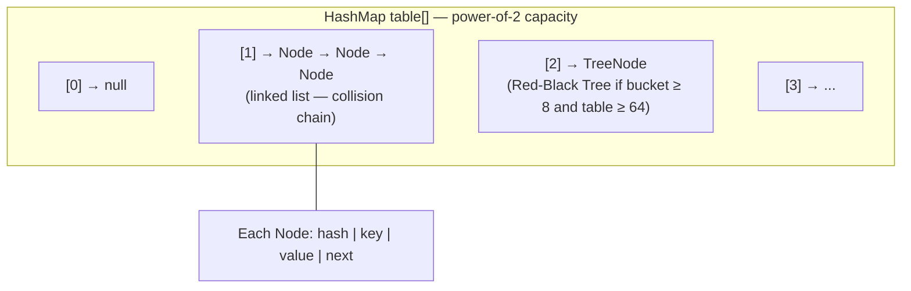

<details>
<summary>ASCII fallback</summary>

```
table[]  (Node<K,V>[] — power-of-2 capacity)
  ├─ [0] → null
  ├─ [1] → Node → Node → Node   (linked list, collision chain)
  ├─ [2] → TreeNode (Red-Black Tree, when bucket ≥ 8 and table ≥ 64)
  └─ ...
```

</details>

Each `Node` holds: `hash`, `key`, `value`, `next`.

#### `put(key, value)` flow

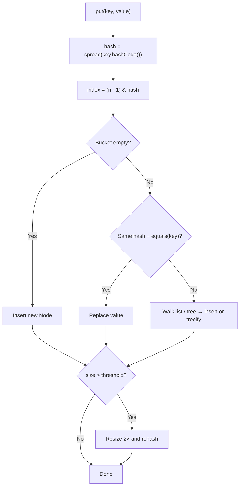

#### `put(key, value)` step-by-step

1. Compute `hash = key.hashCode() ^ (hashCode >>> 16)` — spreads high bits to reduce collisions
2. `index = (n - 1) & hash` — fast modulo via bitmask (capacity always power of 2)
3. If bucket empty → insert new `Node`
4. If first node has same `hash` and `equals(key)` → **replace value**
5. Else walk list/tree → insert or treeify
6. If `size > threshold` (`capacity × loadFactor`, default 0.75) → **resize** (2×) and rehash all entries

#### Treeify / untreeify thresholds

| Condition | Action |
|-----------|--------|
| Bucket list length ≥ **8** AND table length ≥ **64** | Convert list → Red-Black Tree |
| Tree size ≤ **6** | Convert tree → list |
| Table < 64 on treeify trigger | Resize first instead of treeify |

**Why tree?** Worst-case O(n) bucket chains become O(log n) under hash collision attacks or bad `hashCode()`.

#### Resize mechanics

- New capacity = old × 2
- Each entry reindexed: either stays at `i` or moves to `i + oldCap` (no full rehash — clever bit trick)
- Expensive — avoid resizing by setting initial capacity: `new HashMap<>(expectedSize * 4 / 3 + 1)`

#### `get(key)` step-by-step

1. Same hash/index computation
2. Check first node — match hash + equals → return value
3. Else traverse list or search tree
4. Not found → `null`

#### Load factor trade-off

| Load factor | Effect |
|-------------|--------|
| Lower (e.g. 0.5) | Fewer collisions, more memory, fewer resizes |
| Higher (0.75 default) | More memory-efficient, more collisions |
| 1.0 | Dense but slow lookups |

#### Thread safety

`HashMap` is **not** thread-safe. Concurrent `put` during iteration → `ConcurrentModificationException` (fail-fast).

**Alternatives:**
- `ConcurrentHashMap` — bucket-level locking / CAS
- `Collections.synchronizedMap` — global lock per operation (avoid at scale)

#### Interview follow-ups

| Question | Answer |
|----------|--------|
| Why power-of-2 capacity? | Bitmask indexing `(n-1) & hash` is faster than `%` |
| Can two keys collide? | Yes — equals/hashCode contract resolves |
| Mutable key risk? | Hash changes → entry lost in wrong bucket |
| `LinkedHashMap`? | HashMap + doubly-linked list for insertion/access order |
| `TreeMap`? | Red-Black Tree on keys — O(log n), sorted |

---

<a id="dd-jvm-gc"></a>

### JVM Memory & Garbage Collection

> **Quick link from:** [JVM, Memory & Garbage Collection](#jvm-memory--garbage-collection)

#### Runtime memory layout

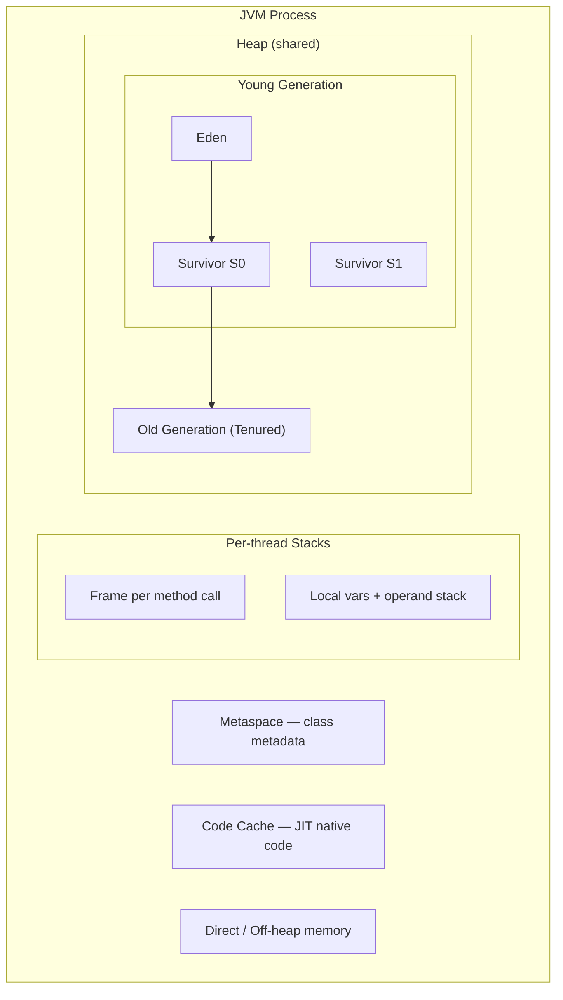

| Where | What lives | GC? |
|-------|------------|-----|
| Stack | Primitives, object references (not objects themselves) | Automatic on frame pop |
| Heap | All objects and arrays | GC manages |
| Metaspace | Class definitions, method metadata | Class unloading (rare) |

#### Object allocation path

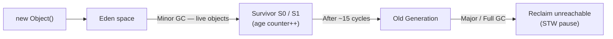

1. **Eden** — new objects allocated here (bump-the-pointer, very fast)
2. **Minor GC** — live objects copied to Survivor (S0/S1); age counter incremented
3. After ~15 cycles (default `MaxTenuringThreshold`) → promoted to **Old gen**
4. **Major/Full GC** — Old gen cleanup; causes STW pauses

#### GC roots

Objects reachable from roots are **live**. Roots include:
- Stack local variables in active threads
- Static fields
- JNI references
- Synchronized monitor objects

Everything else is garbage.

#### Collector comparison (know for interviews)

| Collector | Goal | Pause profile | Use case |
|-----------|------|---------------|----------|
| **G1** (default Java 9+) | Balanced throughput + latency | Target max pause (`-XX:MaxGCPauseMillis`) | General purpose |
| **ZGC** | Ultra-low latency | Sub-ms pauses, scalable | Latency-sensitive services |
| **Shenandoah** | Low pause concurrent | Concurrent compaction | Similar to ZGC |
| **Parallel GC** | Throughput | Longer pauses OK | Batch processing |

#### Tuning flags (production)

```bash
-Xms2g -Xmx2g                    # Fixed heap — avoid resize at runtime
-XX:+UseG1GC
-XX:MaxGCPauseMillis=200
-XX:+HeapDumpOnOutOfMemoryError
-XX:HeapDumpPath=/var/log/heap.hprof
-Xlog:gc*:file=gc.log:time,uptime,level,tags
```

#### OOM types

| Error | Cause |
|-------|-------|
| `Java heap space` | Too many live objects / leak |
| `GC overhead limit exceeded` | GC spending > 98% time, recovering < 2% heap |
| `Metaspace` | Too many classes loaded (dynamic proxies, class loaders) |
| `Unable to create native thread` | Thread explosion |

#### Memory leak patterns in Java

```java
// 1. Static cache never evicted
private static final Map<String, byte[]> CACHE = new HashMap<>();

// 2. Listener not removed
eventBus.register(this); // forgot unregister on shutdown

// 3. ThreadLocal in pool
threadLocal.set(largeObject); // forgot remove() — survives across requests

// 4. Unclosed resources
Connection conn = dataSource.getConnection(); // no try-with-resources
```

**Debug:** heap dump → dominator tree → find largest retained set → inspect GC roots.

---

<a id="dd-concurrency-jmm"></a>

### Concurrency & the Java Memory Model

> **Quick link from:** [Concurrency & Multithreading](#concurrency--multithreading)

#### Happens-before rules (JMM)

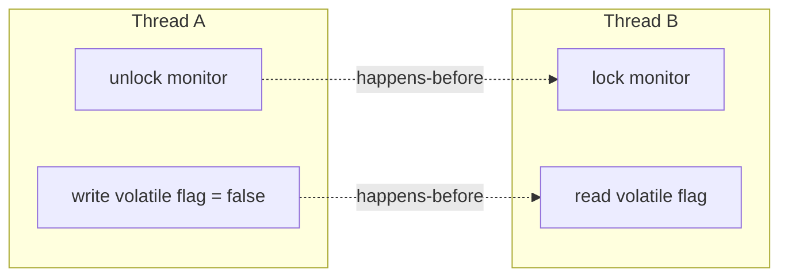

If action A *happens-before* B, then A's effects are visible to B.

| Rule | Example |
|------|---------|
| Program order | Statements in same thread |
| Monitor lock | `unlock` on mutex happens-before next `lock` |
| `volatile` write | Write happens-before subsequent read of same volatile |
| Thread start | `thread.start()` happens-before any action in new thread |
| Thread join | Actions in thread happen-before `join()` returns |

#### `volatile` — what it does and doesn't do

```java
private volatile boolean running = true;

// Thread A
running = false;  // visible to Thread B immediately

// Thread B
while (running) { work(); }
```

| Guarantees | Does NOT guarantee |
|------------|-------------------|
| Visibility across threads | Atomicity of `count++` |
| Ordering (no reorder across volatile access) | Mutual exclusion |

For `i++` use `AtomicInteger` or `synchronized`.

#### `synchronized` vs `ReentrantLock`

```java
// intrinsic lock
synchronized (lock) {
    // critical section
}

// explicit lock
lock.lock();
try {
    // critical section
} finally {
    lock.unlock();  // MUST be in finally
}
```

| Feature | synchronized | ReentrantLock |
|---------|--------------|---------------|
| Auto release | Yes | Manual `unlock()` |
| tryLock / timeout | No | Yes |
| Fair ordering | No | Optional |
| Multiple conditions | No | `newCondition()` |

#### Thread pool sizing (production heuristic)

```
CPU-bound:  pool size ≈ number of cores
IO-bound:   pool size ≈ cores × (1 + wait_time / compute_time)
```

**Never** use `Executors.newCachedThreadPool()` unbounded in production — can create thousands of threads under load.

**Prefer explicit `ThreadPoolExecutor`** with named threads, bounded queue, and rejection policy:

| Rejection policy | Behavior |
|------------------|----------|
| `AbortPolicy` (default) | Throw `RejectedExecutionException` |
| `CallerRunsPolicy` | Caller thread runs task — backpressure |
| `DiscardOldestPolicy` | Drop oldest queued task |
| `DiscardPolicy` | Silently drop |

#### Deadlock detection

```bash
jstack <pid>   # or kill -3 <pid>
# look for "Found one Java-level deadlock"
```

**Prevention:** global lock ordering, `tryLock` with timeout, reduce lock scope.

#### `ConcurrentHashMap` vs `synchronized` HashMap

```java
// NOT atomic — race between get and put
if (!map.containsKey(k)) map.put(k, v);

// Atomic
map.putIfAbsent(k, v);
map.computeIfAbsent(k, key -> expensiveLoad(key));
```

---

<a id="dd-future-completable"></a>

### Future, Callable & CompletableFuture

> **Quick link from:** [Future, Callable, and CompletableFuture](#future-callable-and-completablefuture)

#### How `Future` relates to threads

`Future` does **not** create threads. A **thread pool** runs the work; `Future` is how the caller **waits for or cancels** the result.

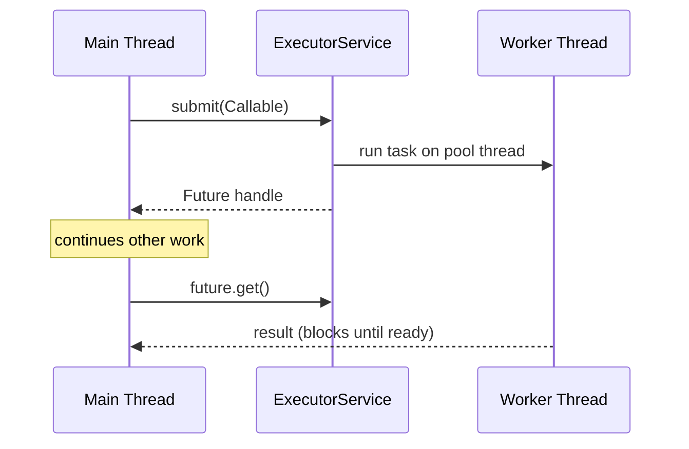

#### Runnable vs Callable vs Future

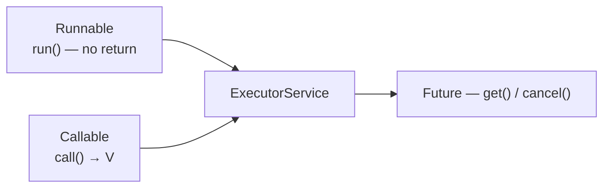

```java
// Runnable — no result
pool.execute(() -> log.info("done"));

// Callable — Future with result
Future<Integer> f = pool.submit(() -> 42);

// Multiple tasks
List<Future<String>> futures = new ArrayList<>();
for (String url : urls) {
    futures.add(pool.submit(() -> fetch(url)));
}
for (Future<String> f : futures) {
    System.out.println(f.get());
}
```

#### `Future` API — interview essentials

| Method | Behavior |
|--------|----------|
| `get()` | Block until complete; throws `ExecutionException` if task failed |
| `get(timeout, unit)` | Block with timeout → `TimeoutException` |
| `isDone()` | Finished (normal, exception, or cancelled) |
| `cancel(true)` | Attempt cancel; `true` = may **interrupt** worker thread |
| `isCancelled()` | Cancelled before completion |

**Exception handling:**

```java
try {
    String data = future.get();
} catch (ExecutionException e) {
    Throwable cause = e.getCause();  // actual exception from Callable
} catch (InterruptedException e) {
    Thread.currentThread().interrupt();
}
```

#### Limitations of plain `Future`

- No callbacks — must block on `get()`
- No easy chaining of dependent async steps
- No combining multiple futures without manual `get()` loops
- `submit()` overloads return raw `Future` — composition is awkward

#### `CompletableFuture` — async pipelines

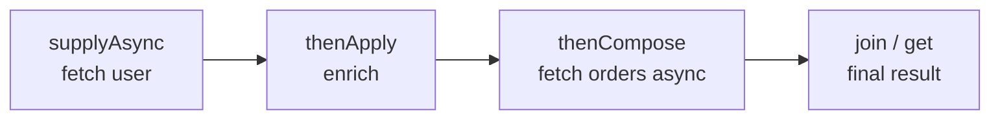

| Method | Purpose |
|--------|---------|
| `supplyAsync(Supplier)` | Start async with return value |
| `runAsync(Runnable)` | Start async, no return |
| `thenApply(fn)` | Transform result (sync) |
| `thenApplyAsync(fn)` | Transform on another thread |
| `thenCompose(fn)` | Flat-map — fn returns another `CompletableFuture` |
| `thenCombine(other, fn)` | Merge two futures |
| `allOf(futures...)` | Wait for all |
| `anyOf(futures...)` | First to complete wins |
| `exceptionally(fn)` | Handle failure |
| `handle(fn)` | Success or failure handler |

```java
CompletableFuture<OrderSummary> summary = CompletableFuture
    .supplyAsync(() -> userService.getUser(id))
    .thenCombine(
        CompletableFuture.supplyAsync(() -> orderService.getOrders(id)),
        (user, orders) -> new OrderSummary(user, orders)
    );

// Spring @Async often returns CompletableFuture
@Async
public CompletableFuture<String> sendEmail(String to) { ... }
```

#### Default executor for `CompletableFuture`

- `supplyAsync()` / `runAsync()` with **no executor** → `ForkJoinPool.commonPool()`
- Production: **always pass explicit executor** (your thread pool or virtual thread executor)

```java
ExecutorService ioPool = Executors.newVirtualThreadPerTaskExecutor();
CompletableFuture.supplyAsync(() -> fetch(), ioPool);
```

#### `Future` vs `CompletableFuture` — interview summary

| | `Future` | `CompletableFuture` |
|---|----------|---------------------|
| Since | Java 5 | Java 8 |
| Chaining | Manual | `thenApply`, `thenCompose` |
| Combine tasks | Manual loops | `allOf`, `anyOf`, `thenCombine` |
| Callbacks | No | Yes |
| Implements `Future` | Yes | Yes (`get()`, `cancel()`) |

**One-liner:** `Future` is the result ticket from a thread-pool task; `CompletableFuture` is a composable, callback-friendly async pipeline — both are thread-related.

---

<a id="dd-virtual-threads"></a>

### Virtual Threads (Java 21+)

> **Quick link from:** [Virtual Threads (Java 21+)](#virtual-threads-java-21)

#### Problem with platform threads

Each **platform thread** = 1 OS thread ≈ **~1 MB stack** + kernel scheduling overhead.

```
10,000 concurrent HTTP requests
  → 10,000 platform threads = heavy memory + context switching
  → thread pool queue grows → latency spikes
```

Most request threads **block waiting** on DB/HTTP — you pay for a full OS thread while it waits.

#### Virtual threads — what they are

**Virtual threads** (Project Loom, finalized Java 21) are **JVM-managed** lightweight threads scheduled onto a small pool of **carrier** (platform) threads.

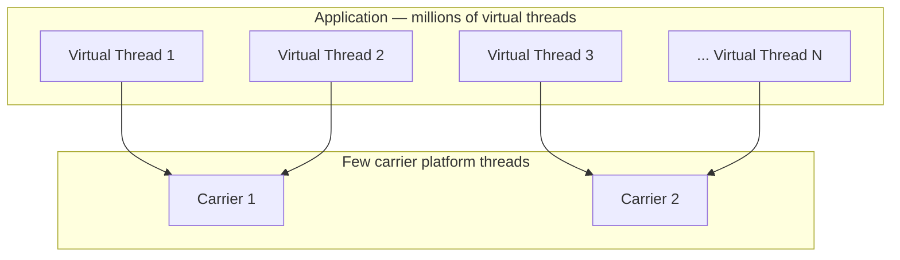

When a virtual thread blocks on IO, the JVM **unmounts** it from the carrier and runs another virtual thread — **no OS thread per request**.

#### Creating virtual threads

```java
// 1. Direct
Thread vt = Thread.ofVirtual().name("worker-", 0).start(() -> handle());

// 2. Java 21 shorthand
Thread.startVirtualThread(() -> handle());

// 3. Executor — preferred for many tasks
try (ExecutorService executor = Executors.newVirtualThreadPerTaskExecutor()) {
    IntStream.range(0, 10_000).forEach(i ->
        executor.submit(() -> processRequest(i))
    );
}
```

**Do NOT pool virtual threads** — they are cheap to create; pooling adds complexity with no benefit.

#### Platform vs virtual — when to use which

| Workload | Use |
|----------|-----|
| CPU-bound (crypto, compression, ML inference) | Platform threads / `ForkJoinPool` sized to cores |
| IO-bound (REST, JDBC, HTTP client, Kafka poll) | Virtual threads |
| Mixed | Virtual threads for request path; dedicated pool for CPU work |

```java
// CPU work — keep off virtual threads or use separate platform pool
ExecutorService cpuPool = Executors.newFixedThreadPool(Runtime.getRuntime().availableProcessors());
```

#### Pinning — critical interview topic

A virtual thread **pinned** to its carrier cannot unmount while blocked → defeats the purpose.

**Causes of pinning:**
1. `synchronized` block/method (JDK improves over time — check your JDK version)
2. Native code / JNI
3. Some legacy libraries holding monitors

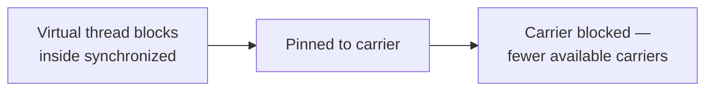

**Mitigation:** use `ReentrantLock` instead of `synchronized` in code running on virtual threads.

```java
// Prefer this on virtual-thread hot paths
private final ReentrantLock lock = new ReentrantLock();
lock.lock();
try {
    // critical section
} finally {
    lock.unlock();
}
```

**Monitor with:** JVM flag `-Djdk.tracePinnedThreads=full` (or `short`) to log pinning.

#### Spring Boot integration

```yaml
# application.yml — Spring Boot 3.2+
spring:
  threads:
    virtual:
      enabled: true
```

- Tomcat / Jetty handle each request on a virtual thread
- `@Async` can use virtual thread executor
- JDBC drivers must be **non-blocking or pin-aware** — most blocking JDBC works but pins during native socket wait (still often OK at scale; test your stack)

#### Structured concurrency (Java 21+ preview/incubator)

Group related virtual threads with clear lifetime — if parent fails, children cancel:

```java
try (var scope = new StructuredTaskScope.ShutdownOnFailure()) {
    Subtask<String> user = scope.fork(() -> fetchUser(id));
    Subtask<List<Order>> orders = scope.fork(() -> fetchOrders(id));
    scope.join();
    scope.throwIfFailed();
    return combine(user.get(), orders.get());
}
```

#### Virtual threads vs reactive (WebFlux)

| | Virtual threads | WebFlux (reactive) |
|---|-----------------|-------------------|
| Style | Imperative (normal Java code) | Functional chains (`Mono`/`Flux`) |
| Debugging | Easier stack traces | Harder — async stacks |
| Learning curve | Low | High |
| JDBC | Works (blocking) | Needs reactive drivers |

**Trend:** Many teams choose virtual threads over reactive for simpler IO-bound services.

#### Interview one-liners

| Question | Answer |
|----------|--------|
| What is a virtual thread? | JVM-managed lightweight thread, not 1:1 with OS thread |
| When to use? | Many concurrent IO-bound tasks |
| Pool virtual threads? | No — create per task |
| vs `CompletableFuture`? | Virtual threads = thread per task, blocking style; CF = callback composition on pools |
| Pinning? | `synchronized`/native blocks carrier — prefer `ReentrantLock` |
| Java version? | Final in **Java 21** (preview in 19–20) |

---

<a id="dd-class-loading"></a>

### Class Loading & Bytecode

#### Class loading phases

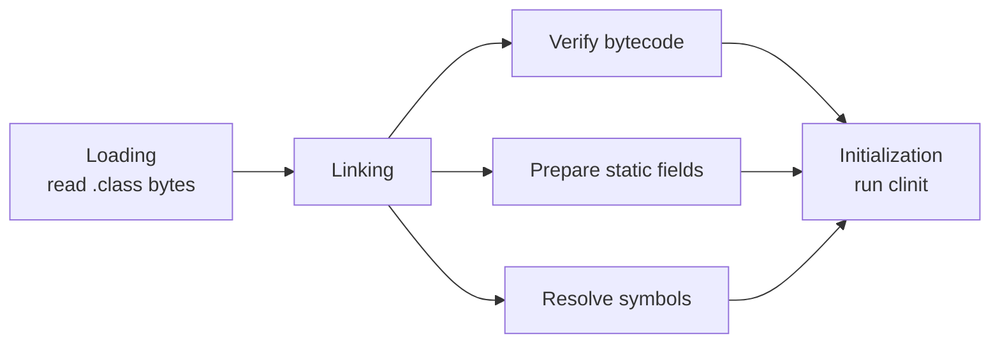

| Phase | What happens |
|-------|--------------|
| **Loading** | Read `.class` bytes, create `Class<?>` object in metaspace |
| **Linking — Verify** | Bytecode safety checks |
| **Linking — Prepare** | Allocate static fields, set defaults |
| **Linking — Resolve** | Symbolic refs → direct refs (can be lazy) |
| **Initialization** | Run `<clinit>` — static blocks and field init |

#### Classloader hierarchy (delegation model)

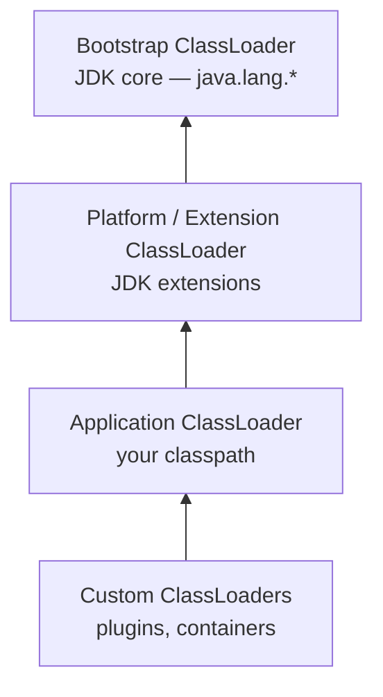

**Delegation:** child asks parent first — prevents loading `java.lang.String` twice from different loaders.

#### When is a class initialized?

- First `new` instance
- First static method/field access
- `Class.forName("com.example.Foo")`
- Subclass init triggers parent init first

**Not initialized** by: referencing a static field that is a compile-time constant.

#### Common interview scenarios

| Scenario | Explanation |
|----------|-------------|
| Spring creates many proxies | CGLIB subclasses → many classes in metaspace |
| `ClassNotFoundException` vs `NoClassDefFoundError` | Former: class not found at load; latter: found at compile, missing at runtime |
| Hot deploy class leaks | Old class loaders retained by references → metaspace OOM |
| `instanceof` with interfaces | Checks class hierarchy at runtime |

#### JIT compilation (brief)

1. Bytecode interpreted initially (C1 — fast compile)
2. Hot methods compiled to native (C2 — aggressive optimizations)
3. Inlining, escape analysis, lock elision on uncontended locks
4. **Deoptimization** if assumptions break (e.g. monomorphic call becomes polymorphic)

---

## Spring Boot Deep Dive

<a id="dd-spring-proxy-transactional"></a>

### AOP Proxies & `@Transactional`

> **Quick link from:** [Q21. `@Transactional` deep dive](#q21-transactional-deep-dive)

#### How Spring applies `@Transactional`

Spring does **not** modify your class bytecode at compile time (by default). At runtime it wraps your bean in a **proxy**:

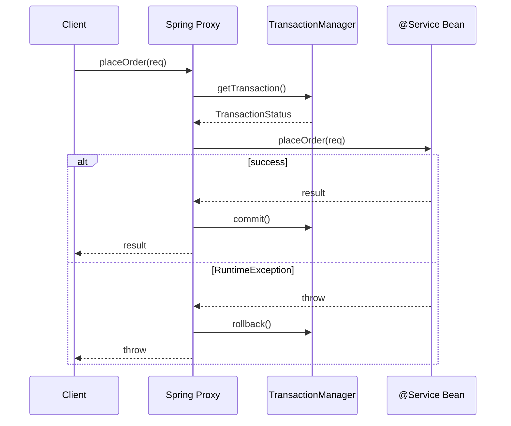

#### JDK dynamic proxy vs CGLIB

| | JDK Proxy | CGLIB Proxy |
|---|-----------|-------------|
| Requires | Interface | Concrete class (subclass) |
| Mechanism | `java.lang.reflect.Proxy` | Bytecode subclass at runtime |
| `final` methods | N/A | **Cannot** intercept `final` |
| Default when | Bean implements interface | No interface |

Spring Boot 2.x+ defaults to CGLIB for class-based proxies (`spring.aop.proxy-target-class=true`).

#### What the proxy actually does

```java
// Conceptual — what Spring generates
public Order placeOrder(CreateOrderRequest req) {
    TransactionStatus status = txManager.getTransaction(def);
    try {
        Order result = target.placeOrder(req);  // your method
        txManager.commit(status);
        return result;
    } catch (RuntimeException ex) {
        txManager.rollback(status);
        throw ex;
    }
}
```

#### Self-invocation trap (most common interview trap)

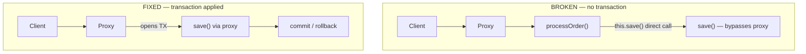

```java
@Service
public class OrderService {
    public void processOrder(Long id) {
        this.save(id);  // DIRECT call — bypasses proxy — NO TRANSACTION
    }

    @Transactional
    public void save(Long id) { ... }
}
```

**Fixes:**
1. Move `@Transactional` method to another `@Service` bean
2. Inject self: `@Lazy @Autowired private OrderService self;` then `self.save(id)`
3. Use `TransactionTemplate` programmatically
4. Use `AspectJ` compile-time weaving (rare)

#### Rollback rules (surprises)

```java
@Transactional  // rolls back on RuntimeException only
public void create() throws IOException {
    repo.save(entity);
    throw new IOException("disk full");  // NOT rolled back by default!
}

@Transactional(rollbackFor = Exception.class)  // rolls back on all exceptions
```

#### Propagation edge cases

| Case | Propagation | Result |
|------|-------------|--------|
| Outer + inner both REQUIRED | Same transaction | Inner failure rolls back all |
| Outer REQUIRED + inner REQUIRES_NEW | Separate TX | Inner commits even if outer rolls back |
| Outer REQUIRED + inner NOT_SUPPORTED | Inner suspends TX | Inner runs non-transactional |
| Read in `REQUIRES_NEW` after outer rollback | Committed read | See uncommitted-isolation artifacts |

#### `@Transactional` on private methods

**Does not work** — proxy only intercepts public methods called through proxy.

---

<a id="dd-jpa-persistence-context"></a>

### JPA Persistence Context & Session

> **Quick link from:** [Q19. LazyInitializationException](#q19-lazyinitializationexception)

#### Persistence context (session)

The persistence context is a **first-level cache** of managed entities within a transaction:

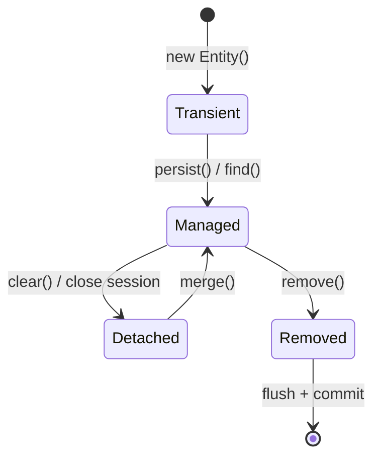

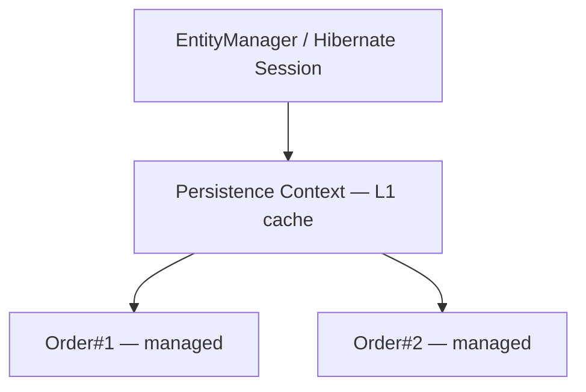

| State | Description |
|-------|-------------|
| **Transient** | New object, not associated with context |
| **Managed** | Tracked — changes auto-flushed to DB on flush/commit |
| **Detached** | Was managed, context closed — changes not tracked |
| **Removed** | Scheduled for deletion |

#### Entity lifecycle operations

```java
em.persist(order);   // transient → managed
em.merge(order);     // detached → managed (copy)
em.remove(order);    // managed → removed
em.find(Order.class, id);  // managed from DB
em.detach(order);    // managed → detached
em.clear();          // detach all
```

#### Flush vs commit

| Operation | Effect |
|-----------|--------|
| `flush()` | SQL sent to DB; **transaction still open** |
| `commit()` | Flush + commit transaction |
| Dirty checking | Hibernate compares managed entity to snapshot — auto UPDATE on flush |

#### Lazy loading mechanics

```java
@ManyToOne(fetch = FetchType.LAZY)
private Customer customer;  // Hibernate injects proxy subclass
```

When you call `order.getCustomer().getName()`:
1. Proxy intercepts call
2. If session open → SELECT from DB
3. If session closed → **`LazyInitializationException`**

#### Open Session In View (OSIV)

Spring Boot enables `spring.jpa.open-in-view=true` by default:
- Session stays open for entire HTTP request
- Lazy loads work in controller — **masks** lazy loading bugs
- Can hide N+1 problems and hold DB connections longer

**Production recommendation:** disable OSIV, use DTOs + fetch joins in service layer.

```yaml
spring.jpa.open-in-view: false
```

#### N+1 — SQL generated

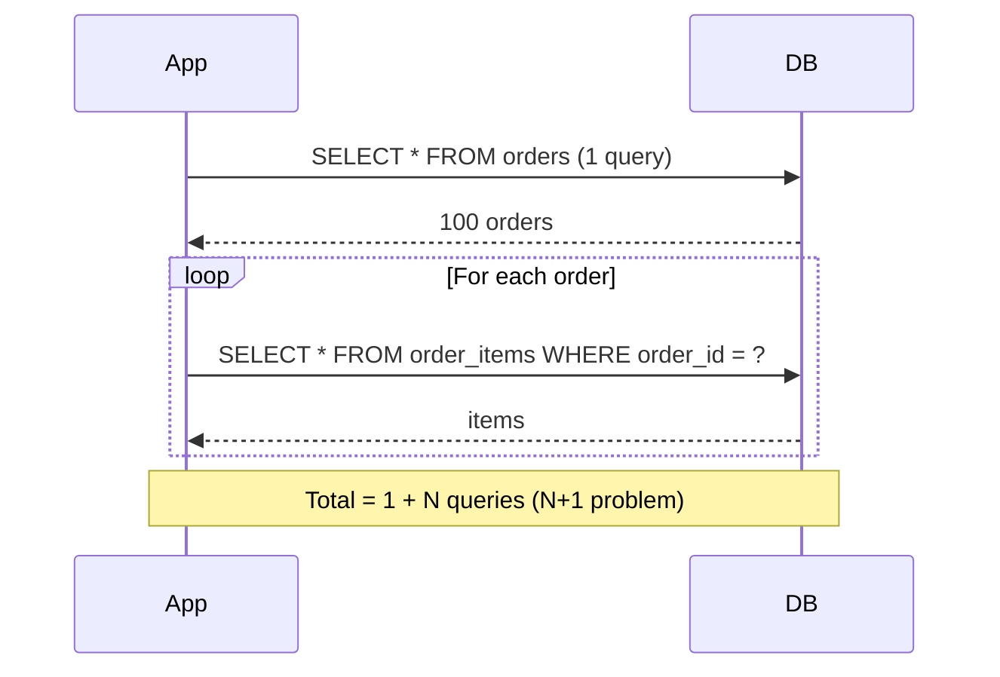

```sql
-- 1 query
SELECT * FROM orders;

-- N queries (one per order)
SELECT * FROM order_items WHERE order_id = ?;
...
```

**Fix with JOIN FETCH:**
```java
@Query("SELECT o FROM Order o JOIN FETCH o.items WHERE o.id = :id")
Optional<Order> findWithItems(@Param("id") Long id);
```

#### Second-level cache (brief)

- Shared across sessions (EhCache, Redis via Hibernate)
- Only for rarely changing reference data
- Invalidation complexity — know it exists, not always recommended

---

<a id="dd-auto-config-conditions"></a>

### Auto-Configuration Conditions

> **Quick link from:** [Q9. How does Spring Boot auto-configuration work?](#q9-how-does-spring-boot-auto-configuration-work)

#### Bootstrapping chain

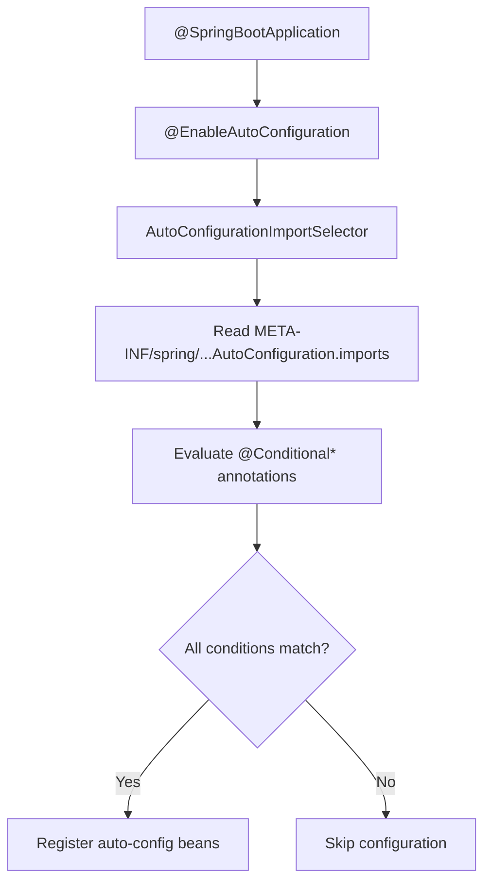

#### Key conditional annotations

| Annotation | Matches when |
|------------|--------------|
| `@ConditionalOnClass` | Class present on classpath |
| `@ConditionalOnMissingClass` | Class absent |
| `@ConditionalOnBean` | Bean of type already exists |
| `@ConditionalOnMissingBean` | No bean of type (user can override) |
| `@ConditionalOnProperty` | `application.properties` value matches |
| `@ConditionalOnWebApplication` | Servlet or reactive web app |
| `@ConditionalOnExpression` | SpEL evaluates true |
| `@ConditionalOnResource` | Resource exists on classpath |

#### Example: DataSource auto-config

```mermaid
flowchart TD
    A["HikariCP on classpath?"] -->|Yes| B["DataSource class present?"]
    A -->|No| X["Skip"]
    B -->|Yes| C["No user DataSource @Bean?"]
    B -->|No| X
    C -->|Yes| D["spring.datasource.url set?"]
    C -->|No| X
    D -->|Yes| E["Create HikariDataSource bean"]
    D -->|No| X
```

#### Overriding auto-config

```java
@Configuration
public class DataSourceConfig {
    @Bean
    @Primary
    public DataSource dataSource() {
        return new HikariDataSource(); // replaces auto-configured bean
    }
}
```

Or exclude entirely:
```java
@SpringBootApplication(exclude = DataSourceAutoConfiguration.class)
```

#### Debugging auto-config report

```bash
java -jar app.jar --debug
# or
logging.level.org.springframework.boot.autoconfigure=DEBUG
```

Output shows:
```
Positive matches: DataSourceAutoConfiguration matched
Negative matches: MongoAutoConfiguration did not match (MongoClient not on classpath)
```

#### `@ConfigurationProperties` binding

```java
@ConfigurationProperties(prefix = "app.kafka")
public record KafkaProps(String topic, int retries) {}

@EnableConfigurationProperties(KafkaProps.class)
@SpringBootApplication
public class App { }
```

Binds `app.kafka.topic` from env vars, YAML, or K8s ConfigMap — type-safe and validated at startup.

---

## Kafka Deep Dive

<a id="dd-kafka-log-segments"></a>

### Log Segments & Storage

#### Partition = append-only log on disk

Each partition is a directory on the broker:

```mermaid
flowchart LR
    subgraph dir["/kafka-logs/order-events-0/"]
        L0["000...000.log<br/>segment"]
        I0["000...000.index<br/>offset → position"]
        T0["000...000.timeindex"]
        L1["000...12345.log<br/>next segment"]
    end
    L0 --- I0
    L0 --- T0
    L0 --> L1
```

| File | Purpose |
|------|---------|
| `.log` | Actual message bytes (batch format) |
| `.index` | Maps offset → byte position in `.log` (sparse index) |
| `.timeindex` | Maps timestamp → offset (for time-based retention) |

#### Write path

```mermaid
sequenceDiagram
    participant P as Producer
    participant L as Partition Leader
    participant F as Followers (ISR)
    participant D as Disk Segment

    P->>L: send batch
    L->>D: append to active segment
    L->>F: replicate
    F-->>L: ack
    L-->>P: ack (per acks config)
    Note over L,D: Roll new segment when segment.bytes or segment.ms hit
```

1. Producer sends batch to **partition leader**
2. Leader appends to active segment (sequential write — fast on HDD/SSD)
3. Followers replicate by fetching from leader (ISR)
4. When segment hits `segment.bytes` or `segment.ms` → roll new segment

#### Read path

```mermaid
flowchart LR
    C["Consumer requests offset N"] --> B["Broker finds segment via .index"]
    B --> S["Seek byte position in .log"]
    S --> R["Read batch → return records"]
```

1. Consumer requests offset N
2. Broker finds segment containing N via index
3. Seeks to position, reads batch, returns records

**Why sequential I/O matters:** Kafka optimized for disk throughput, not random access — can outperform random DB writes at scale.

#### Zero-copy (`sendfile`)

Kafka uses OS `sendfile` to transfer data from disk to network socket without copying through user space — key to high throughput.

#### Retention on disk

| Policy | Mechanism |
|--------|-----------|
| `delete` | Remove segments older than `retention.ms` or exceeding `retention.bytes` |
| `compact` | Keep latest record per key; tombstone (null value) deletes key |

---

<a id="dd-consumer-rebalance"></a>

### Consumer Rebalance Protocol

> **Quick link from:** [Q14. Consumer rebalance](#q14-consumer-rebalance)

#### What is rebalance?

Redistribution of partition ownership among consumers in a group when group membership changes.

```mermaid
flowchart TB
    subgraph before["Before — 2 consumers, 4 partitions"]
        C1a["Consumer 1"] --> P0a["P0"]
        C1a --> P1a["P1"]
        C2a["Consumer 2"] --> P2a["P2"]
        C2a --> P3a["P3"]
    end

    subgraph after["After — Consumer 3 joins"]
        C1b["Consumer 1"] --> P0b["P0"]
        C2b["Consumer 2"] --> P1b["P1"]
        C2b --> P2b["P2"]
        C3b["Consumer 3"] --> P3b["P3"]
    end

    before -->|"rebalance"| after
```

#### Triggers

| Trigger | Config involved |
|---------|-----------------|
| Consumer joins/leaves | — |
| Consumer crash | `session.timeout.ms`, `heartbeat.interval.ms` |
| Processing too slow | `max.poll.interval.ms` exceeded |
| Partition count changed | Admin operation |
| Subscription changed | New topic subscribed |

#### Rebalance protocols

```mermaid
flowchart LR
    subgraph eager["Eager (classic)"]
        E1["Revoke ALL partitions"] --> E2["Stop processing"]
        E2 --> E3["Reassign all"]
    end
    subgraph coop["Cooperative (incremental)"]
        C1["Revoke only moving partitions"] --> C2["Keep stable assignments"]
        C2 --> C3["Assign new partitions"]
    end
```

| Protocol | Behavior | Downside |
|----------|----------|----------|
| **Eager (classic)** | Revoke ALL partitions → reassign | Stop-the-world pause |
| **Cooperative (incremental)** | Revoke only partitions to move | Minimal disruption |

**Use:** `CooperativeStickyAssignor` (Kafka 2.4+)

```properties
partition.assignment.strategy=org.apache.kafka.clients.consumer.CooperativeStickyAssignor
```

#### Rebalance listener hooks

```java
consumer.subscribe(topics, new ConsumerRebalanceListener() {
    @Override
    public void onPartitionsRevoked(Collection<TopicPartition> partitions) {
        consumer.commitSync();  // commit before losing partitions
    }
    @Override
    public void onPartitionsAssigned(Collection<TopicPartition> partitions) {
        // seek to committed offset or reset
    }
});
```

#### Rebalance storm symptoms

- Constant partition revocations
- Consumer lag spikes
- Duplicate processing

**Causes:** `session.timeout.ms` too low, long GC pauses, slow `poll()` loop.

**Fix:** Increase timeouts, optimize processing, cooperative assignor, static membership:

```properties
group.instance.id=consumer-1  # static membership — skip rebalance on brief restart
```

---

<a id="dd-kafka-eos"></a>

### Exactly-Once Semantics (EOS)

> **Quick link from:** [Q17–Q18. Delivery semantics](#q17-at-most-once-at-least-once-exactly-once)

#### The problem

```mermaid
flowchart TB
    subgraph am["At-most-once — commit then process"]
        AM1["Commit offset"] --> AM2["Process message"]
        AM2 -.->|"crash here"| AML["Message LOST"]
    end
    subgraph al["At-least-once — process then commit"]
        AL1["Process message"] --> AL2["Commit offset"]
        AL1 -.->|"crash here"| ALD["Message DUPLICATE on retry"]
    end
    subgraph eo["Exactly-once — Kafka transaction"]
        EO1["Begin transaction"] --> EO2["Process + produce + offset"]
        EO2 --> EO3["Commit transaction"]
        EO3 -.->|"atomic"| EOK["All or nothing"]
    end
```

| Approach | Failure scenario | Result |
|----------|------------------|--------|
| Commit offset then process | Crash after commit | **Lost** message |
| Process then commit offset | Crash after process | **Duplicate** message |

#### Kafka EOS building blocks

```mermaid
flowchart LR
    A["Idempotent Producer<br/>PID + sequence dedup"] --> D["Exactly-once writes"]
    B["Transactional Producer<br/>begin / commit / abort"] --> D
    C["Transactional Consumer<br/>read_committed isolation"] --> D
```

#### Idempotent producer internals

```
Producer ID (PID) assigned by broker
  + per-partition sequence number
  → broker deduplicates retried batches
```

```properties
enable.idempotence=true
# implies: acks=all, retries=MAX, max.in.flight.requests.per.connection=5
```

#### Transactional producer

```java
producer.initTransactions();
producer.beginTransaction();
try {
    producer.send(recordToOrders);
    producer.send(recordToAudit);
    producer.commitTransaction();
} catch (Exception e) {
    producer.abortTransaction();
}
```

Requires unique `transactional.id` per producer instance.

#### consume-transform-produce (exactly-once)

```mermaid
sequenceDiagram
    participant C as Consumer
    participant App as Application
    participant P as Transactional Producer
    participant K as Kafka

    C->>App: poll records (read_committed)
    App->>P: beginTransaction()
    App->>App: process + transform
    App->>P: send output records
    App->>P: send offsets to transaction
    App->>P: commitTransaction()
    P->>K: atomic commit
```

All atomic: either all visible or none.

#### `read_committed` vs `read_uncommitted`

| Isolation | Consumer sees |
|-----------|---------------|
| `read_uncommitted` | All messages (including uncommitted transactions) |
| `read_committed` | Only committed transactions (default for EOS) |

#### Practical production recommendation

| Requirement | Approach |
|-------------|----------|
| Most services | **At-least-once** + idempotent consumer |
| Billing / ledger | Kafka EOS or DB idempotency key |
| Cross-system (DB + Kafka) | **Outbox pattern** — EOS alone doesn't span DB |

---

<a id="dd-transactional-outbox"></a>

### Transactional Outbox Pattern

> **Quick link from:** [Q32. Transactional Outbox pattern](#q32-transactional-outbox-pattern-critical-for-interviews)

#### The dual-write problem

```mermaid
flowchart TB
    S["@Transactional placeOrder()"]
    S --> DB["orderRepo.save() — DB TX"]
    S --> K["kafkaTemplate.send() — separate system"]
    DB -.->|"DB ok, Kafka fails"| BAD1["Order saved, no event"]
    K -.->|"Kafka ok, DB fails"| BAD2["Event sent, no order"]
```

```java
@Service
@Transactional
public void placeOrder(Order o) {
    orderRepo.save(o);           // TX 1: DB
    kafkaTemplate.send("events", o);  // NOT in same TX — can fail independently
}
```

Failure modes:
| Step fails | State |
|------------|-------|
| DB ok, Kafka fails | Order exists, no event — downstream never notified |
| Kafka ok, DB fails | Event published, no order — inconsistent |

#### Outbox solution

```mermaid
flowchart TB
    subgraph tx["Single DB transaction"]
        O["INSERT INTO orders"]
        OB["INSERT INTO outbox"]
    end
    O --> COMMIT["COMMIT"]
    OB --> COMMIT
    COMMIT --> Relay["Outbox Relay / Debezium CDC"]
    Relay --> Kafka["Kafka topic"]
```

```sql
-- Same database transaction
BEGIN;
  INSERT INTO orders (...) VALUES (...);
  INSERT INTO outbox (id, aggregate_type, aggregate_id, payload, created_at)
    VALUES (uuid, 'Order', order_id, '{"status":"PLACED"}', now());
COMMIT;
```

Separate **relay process** reads outbox → publishes to Kafka → marks row as sent (or deletes).

#### Implementation options

| Approach | How | Pros | Cons |
|----------|-----|------|------|
| **Polling publisher** | Scheduled job queries `WHERE sent=false` | Simple | Latency, polling load |
| **Debezium CDC** | Reads DB WAL/binlog → Kafka | Near real-time, no poll | Ops complexity |
| **Transactional messaging** | XA / chained TX | True atomicity | Slow, fragile — avoid |

#### Polling publisher (Spring example)

```java
@Scheduled(fixedDelay = 1000)
@Transactional
public void publishOutbox() {
    List<OutboxEvent> pending = outboxRepo.findTop100BySentFalseOrderByCreatedAt();
    for (OutboxEvent event : pending) {
        kafkaTemplate.send(event.getTopic(), event.getKey(), event.getPayload());
        event.setSent(true);
    }
}
```

Use `SELECT ... FOR UPDATE SKIP LOCKED` for multi-instance relays.

#### Outbox table schema

```sql
CREATE TABLE outbox (
    id            UUID PRIMARY KEY,
    aggregate_type VARCHAR(100) NOT NULL,
    aggregate_id   VARCHAR(100) NOT NULL,
    event_type     VARCHAR(100) NOT NULL,
    payload        JSONB NOT NULL,
    created_at     TIMESTAMP NOT NULL DEFAULT now(),
    sent_at        TIMESTAMP,
    INDEX idx_outbox_unsent (sent_at, created_at)
);
```

#### Pair with inbox (idempotent consumer)

```mermaid
flowchart TD
    E["Event received"] --> TX["BEGIN TX"]
    TX --> CHK{"message_id in inbox?"}
    CHK -->|Yes| SKIP["Skip — already processed"]
    CHK -->|No| PROC["Process business logic"]
    PROC --> INS["INSERT INTO inbox"]
    INS --> COMMIT["COMMIT"]
    SKIP --> COMMIT
```

Together: **at-least-once delivery + idempotent processing = effectively-once**.

#### End-to-end flow (interview gold)

```mermaid
flowchart TB
    API["REST API"] --> OS["Order Service"]
    OS --> TX["BEGIN TX"]
    TX --> ORD["INSERT orders"]
    TX --> OUT["INSERT outbox"]
    TX --> CMT["COMMIT"]
    CMT --> REL["Outbox Relay / Debezium"]
    REL --> KFK["Kafka: order-events"]
    KFK --> INV["Inventory Service"]
    KFK --> PAY["Payment Service"]
    INV --> IN1["inbox check → process"]
    PAY --> IN2["inbox check → process"]
```

**Key talking points:**
- Ordering: partition by `orderId`
- Idempotency: inbox table + unique `message_id`
- Failure: relay retries; consumers idempotent
- Observability: correlation ID in outbox payload and Kafka headers

---

# Cross-Topic Integration

## Common combined interview scenarios

### Scenario 1: Place order API → downstream processing

```mermaid
flowchart LR
    Client --> REST["REST Controller"]
    REST --> Svc["@Transactional OrderService"]
    Svc --> DB[(Database + Outbox)]
    DB --> Relay["Debezium / Relay"]
    Relay --> Kafka["order-events topic"]
    Kafka --> Inv["Inventory @KafkaListener"]
    Kafka --> Pay["Payment @KafkaListener"]
```

**Be ready to explain:** transaction boundaries, outbox, idempotent consumers, correlation IDs.

---

### Scenario 2: Debugging high consumer lag

1. Check `max.poll.interval.ms` vs processing time
2. Profile consumer logic (DB slow queries?)
3. Scale consumers (≤ partition count)
4. Increase partitions (plan ahead — can't decrease)
5. Check rebalance storms (cooperative assignor)
6. Review batch size and parallelism

---

### Scenario 3: Exactly-once order processing

1. DB unique constraint on `event_id`
2. Inbox table pattern
3. Or Kafka transactional consume-process-produce
4. Idempotent producer for outbound events

---

### Scenario 4: Spring `@Transactional` + Kafka — antipattern

```java
@Transactional
public void handle(Event e) {
    db.save(e);
    kafkaTemplate.send("topic", e); // NOT in same transaction!
}
```

Kafka send is **not** part of DB transaction. Use outbox pattern.

---

## Observability checklist

| Signal | Java/Spring | Kafka |
|--------|-------------|-------|
| Logs | SLF4J + correlation ID | Log partition/offset/key |
| Metrics | Micrometer, JVM metrics | Consumer lag, throughput |
| Traces | OpenTelemetry | Propagate trace context in headers |
| Health | Actuator `/health` | Consumer group status |

---

# Mock Interview Cheat Sheet

## One-liner answers

| Question | Answer |
|----------|--------|
| HashMap thread-safe? | No → `ConcurrentHashMap` |
| Default bean scope? | Singleton |
| `@Transactional` rollback? | RuntimeException + Error (not checked by default) |
| Kafka ordering? | Per partition only |
| Max consumers in group? | ≤ partition count |
| Strongest producer durability? | `acks=all` + `min.insync.replicas=2` |
| Most common delivery? | At-least-once + idempotent consumer |
| N+1 fix? | JOIN FETCH / `@EntityGraph` |
| Dual write problem? | Transactional outbox |
| Self-invocation + `@Transactional`? | Proxy bypassed — extract bean |
| `Future` vs `CompletableFuture`? | Future = blocking result ticket; CF = composable async pipeline |
| Virtual threads vs platform threads? | Virtual = cheap IO-bound (Java 21+); platform = CPU-bound / legacy |
| Pool virtual threads? | No — create per task |

---

## Trade-off quick reference

| Decision | Option A | Option B |
|----------|----------|----------|
| Sync vs async | REST (simple, coupled) | Kafka (decoupled, eventual) |
| JSON vs Avro | Easy dev | Production schema evolution |
| Lazy vs Eager JPA | Performance default | Eager only when needed |
| Auto vs manual offset commit | Simple | Safer processing guarantees |
| Platform threads vs virtual threads | Fixed pool, CPU work | Millions of IO-bound tasks (Java 21+) |
| Monolith vs microservices | Faster iteration | Independent scale/deploy |

---

# 3-Day Study Plan

## Day 1 — Java (4–6 hours)

| Block | Topics | Practice |
|-------|--------|----------|
| Morning | OOP, equals/hashCode, String, collections | Explain HashMap put flow on whiteboard |
| Afternoon | Concurrency: synchronized, volatile, Future, virtual threads | Explain Future vs thread pool |
| Evening | JVM memory, GC, streams, Optional | Review 5 common pitfalls |

**Self-test:** Explain pass-by-value with a `List` example. Draw HashMap bucket collision resolution.

---

## Day 2 — Spring Boot (4–6 hours)

| Block | Topics | Practice |
|-------|--------|----------|
| Morning | IoC/DI, bean lifecycle, auto-config | Draw bean lifecycle diagram |
| Afternoon | REST, validation, exception handling, `@Transactional` | Explain self-invocation trap |
| Evening | JPA: relationships, N+1, lazy loading | Write JOIN FETCH query |

**Self-test:** Trace HTTP request from Tomcat to DB and back. List 5 `@ConditionalOn*` annotations.

---

## Day 3 — Kafka + Integration (4–6 hours)

| Block | Topics | Practice |
|-------|--------|----------|
| Morning | Architecture, partitions, consumer groups, offsets | Design topic with partition strategy |
| Afternoon | Delivery semantics, replication, producer acks | Compare at-least-once vs exactly-once |
| Evening | Spring Kafka, outbox, DLT, schema evolution | Whiteboard order-event flow end-to-end |

**Self-test:** Explain rebalance. Design outbox pattern for order service.

---

## Interview day (30 min review)

- [ ] [Deep Dive](#deep-dive) — HashMap, `@Transactional` proxy trap, Future, virtual threads, Kafka outbox
- [ ] SOLID + one design pattern example
- [ ] `@Transactional` propagation and rollback rules
- [ ] Kafka ordering + consumer group rules
- [ ] Outbox pattern diagram
- [ ] One debugging story
- [ ] One "I designed X with Kafka" story

---

# Further Reading

| Topic | Resource |
|-------|----------|
| Java Concurrency | *Java Concurrency in Practice* (Goetz) |
| Effective Java | *Effective Java* 3rd Ed (Joshua Bloch) |
| Spring Boot | [spring.io/guides](https://spring.io/guides) |
| Spring Kafka | [Spring for Apache Kafka docs](https://docs.spring.io/spring-kafka/reference/) |
| Kafka internals | [Kafka documentation](https://kafka.apache.org/documentation/) |
| System design | *Designing Data-Intensive Applications* (Kleppmann) |
| Outbox pattern | [microservices.io - Transactional Outbox](https://microservices.io/patterns/data/transactional-outbox.html) |

---

*Last updated: June 2025 — covers Java 21+ (virtual threads), Spring Boot 3.x, Kafka 3.x/4.x (KRaft). Includes [Deep Dive](#deep-dive) with Mermaid diagrams.*
